# Architecture

> The front door to `docs/architecture/`. This page orients and routes — it
> does not re-narrate the subsystems. For the cross-subsystem story of either
> side, follow its spine; for a single subsystem, go straight to its page.

## The two sides

The codebase splits along one seam: a headless engine, and whatever drives it.

- **[Engine](engine/overview.md)** — the SWN faction-turn system. A composition
  root (`engine.Engine`) owning a rulebook, a roller, a hook registry, and seven
  sub-engines, sequenced by a phase-oriented orchestrator. It is **headless by
  design**: it talks to its driver through exactly two interfaces — a collector
  supplying decisions in, a fire-and-forget observer reporting events out — and
  cannot tell who is on the other side.

- **[Interface](interface/overview.md)** — whatever drives the engine through
  that seam. Today that is a single Bubble Tea TUI (`internal/faction/tui/`); the
  side is named "interface" rather than "tui" because the same seam is meant to
  back a rebuilt CLI and any future frontend, none of which the engine can tell
  apart.

The two spines never duplicate each other: the engine pages describe what
happens when a turn resolves, the interface pages describe how a human (or, one
day, an AI planner) drives that resolution.

```mermaid
---
config:
  theme: base
  themeVariables:
    background: '#1e1e2e'
    primaryTextColor: '#cdd6f4'
    lineColor: '#bac2de'
---
block
  columns 3
  Drivers["Drivers<br>(TUI today;<br>future CLI / AI planner)"]
  block:Seam
    columns 3
    ArrowInL<["decisions in"]>(right)
    Collector(["collector"])
    ArrowInR<["&nbsp;"]>(right)
    ArrowOutL<["&nbsp;"]>(left)
    Observer(["observer"])
    ArrowOutR<["events out"]>(left)
  end
  Engine["Engine — composition root<br>rulebook · roller · hook registry<br>7 sub-engines · orchestrator"]

  style Drivers   fill:#89b4fa,stroke:#5a7fd6,color:#1e1e2e,stroke-width:1px
  style Engine    fill:#cba6f7,stroke:#a47fd6,color:#1e1e2e,stroke-width:1px
  style Collector fill:#f38ba8,stroke:#d6607f,color:#1e1e2e,stroke-width:1px
  style Observer  fill:#f38ba8,stroke:#d6607f,color:#1e1e2e,stroke-width:1px
  style ArrowInL  fill:#45475a,stroke:#585b70,color:#cdd6f4
  style ArrowInR  fill:#45475a,stroke:#585b70,color:#cdd6f4
  style ArrowOutL fill:#45475a,stroke:#585b70,color:#cdd6f4
  style ArrowOutR fill:#45475a,stroke:#585b70,color:#cdd6f4
  style Seam      fill:none,stroke:none
```



<br/>

## How these pages work

Each side has the same shape:

- **A spine (`overview.md`)** — the cross-subsystem narrative plus a page index.
  Read it first to get the whole side in one pass.
- **One page per subsystem** — each follows a fixed template: **Purpose** (is
  this the page you need?), **Shape** (the structural story — types, data flow,
  boundaries), **Key Decisions** (the durable "why it's shaped this way"), and
  **Dependencies** (what it leans on / what leans on it). Pages backed by
  rulebook data may also carry a **catalogue** (e.g. the Actions, Goals, and
  Mutation catalogues on the engine side).

**Key Decisions sections are the primary read surface.** This is a push-not-pull
system: rather than hunting a decisions log, you read the decisions where you'll
trip over them — on the page for the subsystem you're changing. Discovery and
Plan sessions read the relevant page's Key Decisions as binding context before
designing, and the pre-merge checklist *appends* newly-durable decisions there.

**Routing rule.** Anything about a single subsystem lives on that subsystem's
page; only narrative that genuinely spans subsystems lives on a spine. If you're
unsure where something belongs, it belongs on a page.

<br/>

## Where to start

| If you want… | Read |
|--------------|------|
| The whole engine in one pass | [engine/overview.md](engine/overview.md) |
| The whole interface in one pass | [interface/overview.md](interface/overview.md) |
| How a faction turn resolves end to end | [engine/overview.md](engine/overview.md) → [orchestrator](engine/orchestrator.md) |
| How the TUI drives the engine | [interface/overview.md](interface/overview.md) → [event stream](interface/event-stream.md) |
| The "why" behind a subsystem before changing it | that subsystem's page, **Key Decisions** |

<br/>

## The tree

```
docs/architecture/
  architecture-overview.md   ← you are here (front door)
  engine/
    overview.md          orchestrator.md      turn-pipeline.md
    actions.md           goals.md             hooks.md
    world-movement.md    spatial.md           effect-mutation.md
    persistence.md       narrative-digest.md  logging-errors.md
  interface/
    overview.md          regions.md           state-machine.md
    event-stream.md      overlays.md          views.md
```
