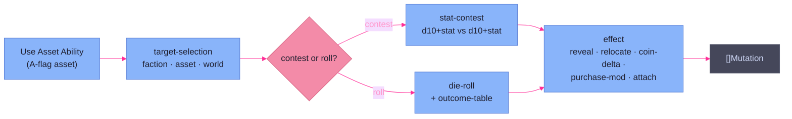

# Ability & Effect Catalog

> **Code:** A-flag → `internal/faction/engine/action/actions/ability/`; S-flag →
> `internal/faction/engine/effect/`; shapes → `internal/faction/domain/asset.go`;
> parser → `internal/faction/rulebook/rulebook.go`.
>
> **Status:** design catalog for the F.022 arc (data-driven abilities + effects).
> Survey verified against the SWN asset data and the dispatch source; the
> registry it specifies is **not yet built** — this page is the input that
> settles its shape.

## Purpose

The engine resolves a single special — "what an asset *does* beyond a plain
attack" — through one of two engines, and the choice is decided by the asset's
**flag**, not by what the special does:

- **`A`-flag → the abilities engine** (`ability.Dispatch`): an *active* ability
  the faction spends its turn action on (`Use Asset Ability`).
- **`S`-flag → the effects engine** (`EffectsEngine` + [hooks](hooks.md)): a
  *passive or reactive* feature the asset carries just by existing.

This page is the catalog that decomposes every `A`- and `S`-flag special into a
small, finite set of **data-driven primitives**, so both engines can resolve
specials from rulebook data instead of one bespoke Go handler per asset ID. It
is organized by primitive (not by asset category or surface) so the clusters —
the reuse — are visible directly.

The same effect can appear on either surface (`relocate-other` is both Covert
Shipping's spent action and Transit Web's free passive). The flag picks the
engine; the effect picks the primitive. **Keep the two columns separate**: a
catalog entry is always *(surface, primitive)*, never primitive alone.

## The two coded exemplars

Two specials are wired today, one per surface — they anchor the target model:

| Surface | Exemplar | Shape | Why it's the anchor |
|---|---|---|---|
| **`S` (effects)** | `transport` (`effects/transport.go`) | `TransportReactor` registered per asset whose def carries a `Transport` profile (`core.go:58`) | The *only* genuinely data-driven special today: behavior is a parameterized profile read off the rulebook, zero per-asset code. The S-side target. |
| **`A` (abilities)** | `informers` (`ability/informers.go`) | bespoke Go handler in a `map[def.ID]` (`dispatch.go:21`) | The *only* real A-handler; everything else in the map is a `confirmApplied` no-op stub. ID-bound and prefix-fragile — the R.018 target. |

The gap between them is the whole problem: the S-exemplar is the shape we want
everywhere; the A-exemplar is the shape we want to *replace*.

## Latent vocabulary already in the domain (and partly dead)

A first pass at this registry already exists in `domain.AssetDefinition`, stalled
half-wired. The catalog reuses and repairs it rather than inventing fresh:

| Field / value | Intended use | Reality today |
|---|---|---|
| `AbilityDefinition.Die *DiceRoll` | roll for an outcome-table ability | **dead** — `convertAbility` never reads it |
| `AbilityDefinition.Outcomes []AbilityOutcome{From,To,Coin}` | die-range → coin payout | **dead** — never parsed |
| `AbilityEffectType` = `reveal_stealth` | reveal effect | **wired** (Informers only) |
| `AbilityEffectType` = `coin_drain`, `coin_steal` | coin transfer effects | parse fine, **dispatched nowhere** |
| `[[ability.steps]]` in Seductress TOML | multi-step ability | **silently dropped** — `abilityRecord` has no `steps` field, so Seductress's reveal no-ops today |

The economic cluster (below) is the clearest payoff: `Die` + `Outcomes` already
models it, and only the parser and a handler are missing.

---

## A-flag — the abilities engine (action-spent)

Thirteen assets carry the `A` flag. They resolve through `ability.Dispatch`,
which today is a `map[def.ID]AbilityHandler`. The registry replaces that map
with composition: **target-selection → (stat-contest | die-roll) → effect**.

### Composable primitives (the A-side spine)

| Primitive | What it does | Status |
|---|---|---|
| **target-selection** | pick a faction / asset / world / a world's assets | partial (`SelectFactionTestTarget` exists for reveal) |
| **stat-contest** | `d10 + attackerStat` vs `d10 + defenderStat`, attacker wins on strictly greater | wired *inside* `informers`, not extracted |
| **die-roll + outcome-table** | roll `Die`, map result ranges via `Outcomes` | scaffolded (`Die`/`Outcomes`) but dead |

### A-flag effects, by primitive

| Effect (primitive) | Assets | Notes |
|---|---|---|
| **roll-table-coin** | Harvesters `SWN-W1-002`, Postech Industry `SWN-W3-001`, Venture Capital `SWN-W6-001`, Pretech Manufactory `SWN-W7-001` | pure `Die`+`Outcomes`. Manufactory's "half, round up" is a payout-formula variant of the same table |
| **roll-table → purchase-discount** | Commodities Broker `SWN-W6-003` | roll-table whose result modifies the *next purchase cost*, not Coin directly |
| **stat-contest → reveal-stealth** | Informers `SWN-C1-002` ✅, Seductress `SWN-C2-004` | Informers wired; Seductress also relocates one hex first (contest composed after a move) |
| **stat-contest → coin-or-disable** | Marketers `SWN-W5-001` | success forces target to pay half an asset's cost or have it disabled |
| **coin-drain (on attack)** | Monopoly `SWN-W4-002` | flagged `A` but reads reactive ("when it successfully attacks"); flag-vs-text mismatch flagged below |
| **relocate-other (action-spent)** | Covert Shipping `SWN-C3-003`, Covert Transit Net `SWN-C6-002` | relocate *another* asset for Coin; the transport primitive is a *carrier* reactor, so these need a sibling shape |
| **purchase-enabler** | Pretech Logistics `SWN-F5-002` | spend the action to buy one discounted Force asset on the world |
| **attach / restrict-action** | Seditionists `SWN-C4-004` | pay `1d4` Coin to attach to an enemy asset, suppressing its attack |

---

## S-flag — the effects engine (passive / reactive)

The `S`-flag specials register [hooks](hooks.md) at cycle start through
`EffectsEngine.ApplyAll`. Each effect maps to one of the **five hook
categories**; the catalog's job on this side is to define the data shape that
lets a handler register the right hook from a profile, the way `transport`
already does. (`effect-mutation.md` already names the hook category for several
of these; this table reconciles with it and completes the survey.)

| Effect | Hook category | Assets |
|---|---|---|
| **transport** (carrier + cargo) | Cat 3 `MutationReactor` | Heavy Drop `SWN-F2-001`, Beachhead Landers `SWN-F4-001`, Extended Theater `SWN-F4-002`, Deep Strike Landers `SWN-F7-001`, Smugglers `SWN-C1-001`, Freighter Contract `SWN-W2-001`, Shipping Combine `SWN-W4-001`, Blockade Runners `SWN-W5-003` ✅ |
| **relocate-other (free)** | Cat 3 `MutationReactor` | Transit Web `SWN-W7-003` — same effect as the A-flag relocate, but no action |
| **self-damage-on-attack** | Cat 3 `MutationReactor` | Zealots `SWN-F3-001` |
| **coin-steal-on-attack** (once/turn) | Cat 3 `MutationReactor` | Blockade Fleet `SWN-F5-001`, Franchise `SWN-W1-001` → `coin_steal` |
| **coin-drain-on-attack** (target loses, attacker doesn't gain) | Cat 3 `MutationReactor` | Local Investments `SWN-W1-003` (purchase surcharge), and Monopoly's reactive reading → `coin_drain` |
| **death-redirect** (intercept a killing blow) | Cat 3 `MutationReactor` | False Front `SWN-C1-003`, Boltholes `SWN-C5-003`, Medical Center `SWN-W4-003` |
| **acquire-on-kill** (take the asset instead of destroying) | Cat 3 `MutationReactor` | Hostile Takeover `SWN-W7-002`, Treachery `SWN-C7-003` |
| **passive income** (per-turn Coin) | Cat 3 `MutationReactor` (turn-start) | Party Machine `SWN-C4-001` |
| **reactive reveal-stealth** (on stealth arrival / per turn) | Cat 3 `MutationReactor` | Tripwire Cells `SWN-C4-003`, Panopticon Matrix `SWN-C8-001` |
| **start-stealthed** | Cat 5 `RuleModifier` (on add) | Psychic Assassins `SWN-F5-003` |
| **grant-stealth** (quality bought for another asset) | Cat 5 `RuleModifier` | Stealth `SWN-C3-002` |
| **bonus-die** (extra die on a roll class) | Cat 1 `RollModifier` | Integral Protocols `SWN-F7-002` (Cunning defense), Surveyors `SWN-W2-004` (Expand Influence), Panopticon `SWN-C8-001` (Cunning attacks/defenses) |
| **reroll** (force/allow one reroll, once/turn) | Cat 2 `RollResultHook` | Book of Secrets `SWN-C7-002` |
| **negate-bonus** (suppress tag dice) | Cat 1 `RollModifier` | Blackmail `SWN-C2-003` |
| **reflect-on-defense** | Cat 2 `RollResultHook` / rule | Cracked Comms `SWN-C5-002` |
| **attack/defense restriction** | Cat 5 `TieResolver` / rule | Planetary Defenses `SWN-F6-002` (Starship-only), Lawyers `SWN-W2-002` (not vs Force) |
| **restrict-action on target** | Cat 3 `MutationReactor` | Saboteurs `SWN-C2-002` (no abilities), Transport Lockdown `SWN-C6-001` (no transport in) |
| **cost-ignore** (skip a Coin loss, once/turn) | Cat 4 `AssetCostModifier` / rule | Bank `SWN-W4-004` |
| **purchase surcharge on rivals** | Cat 4 `AssetCostModifier` | Local Investments `SWN-W1-003` |
| **tech-level uplift** (treat world/faction at higher TL) | Cat 4 `AssetCostModifier` | Laboratory `SWN-W3-002`, Pretech Researchers `SWN-W5-002`, R&D Department `SWN-W6-002` |
| **auto-permission / revoke-permission** | Cat 4 `RuleModifier` | Popular Movement `SWN-C7-001` (grant), Lobbyists `SWN-C2-001` (revoke, reactive contest) |
| **reactive contest** (test on an enemy event) | Cat 3 + stat-contest | Lobbyists `SWN-C2-001`, Tripwire Cells `SWN-C4-003` |

**Dual-flag assets** (`A`+`S`: Informers, Seductress, Covert Shipping) resolve
their *active* mechanic through the abilities engine; any passive side, if it
exists, registers through the effects engine. For these three the substantive
mechanic is the active one — the `S` flag is near-vestigial.

---

## The data shape (how a special is declared)

The arc must make the surface **visible in the data**. A reader of an asset's
TOML should see immediately which engine owns its special:

- An **`[ability]`** block (with `effect`, optional `[contest]`, optional
  `[roll]`/`outcomes`) declares an `A`-flag active ability → abilities engine.
- An **`[effect]`** block (or a typed profile like `[transport]`) declares an
  `S`-flag passive/reactive feature → effects engine.

The dead `Die`/`Outcomes` fields and the dropped `[[ability.steps]]` get
resolved here: either fill them in as the real shape, or remove them. The
`coin_steal`/`coin_drain` enum values get their handlers (S-side) so they stop
being declared-but-dead.

## R.004 decision — full data-driven registry, both engines

**Decision (Robert, this session): build the full data-driven registry for
*both* surfaces within this initiative, making F.022 an arc.** Not the middle
path (wire only the cheap cluster) and not bespoke-only.

What that commits to:

1. **R.018 first** — replace the `map[def.ID]` A-dispatch with dispatch keyed on
   the ability's **effect/primitive**, not its asset ID. This removes the only
   surface the asset prefix breaks and is the prerequisite increment.
2. **A-side primitives** — target-selection, stat-contest, die-roll/outcome-table,
   and the effects in the A-flag table, all data-driven.
3. **S-side primitives** — the effects in the S-flag table, each registering its
   hook category from a profile, the way `transport` does today.
4. **Repair the latent vocabulary** — fill or remove `Die`/`Outcomes` and the
   `steps` shape; wire `coin_steal`/`coin_drain`.

The catalog shows the target is finite and clustered (the A-side is ~5 primitives
over 13 assets; the S-side maps cleanly onto the 5 existing hook categories), so
"full registry" is a bounded build, not an open-ended one.

## Drift evidence (what ID-bound dispatch costs today)

- **The A-map is 1 real handler + 9 no-op stubs.** Every stub is an asset whose
  ability is "not yet coded," masked as `confirmApplied`.
- **`relocate-other` is a parametric near-miss on *both* surfaces** — Covert
  Shipping/Transit Net (A) and Transit Web (S) all want a relocation the
  carrier-shaped `transport` primitive can't express. Three assets, one missing
  primitive.
- **`coin_steal`/`coin_drain` are declared but dead** — the enum anticipated the
  effect; no dispatch consumes it.
- **Seductress silently no-ops** — its `[[ability.steps]]` is dropped at parse,
  so an authored ability does nothing. ID-bound dispatch hid this.

## Key Decisions

- **The flag picks the engine, the effect picks the primitive.** `A` → abilities
  engine (action-spent), `S` → effects engine (passive/reactive via hooks). The
  same effect (e.g. relocate-other) can live on either surface; a catalog entry
  is always *(surface, primitive)*.
- **R.004 is built in full, both surfaces, within this arc.** Data-driven
  registries replace per-ID dispatch; R.018 (effect-keyed A-dispatch) is the
  prerequisite increment.
- **Reuse the latent domain vocabulary, don't reinvent it.** `Die`/`Outcomes`,
  the `Effect` enum, and the `transport` profile are the seed; the arc fills the
  gaps and removes the dead branches.
- **The surface is visible in the data.** `[ability]` vs `[effect]` blocks (or
  typed profiles) tell a reader which engine owns a special without reading code.

## Open reconciliations (carried into the arc)

- **Monopoly's flag-vs-text mismatch** — flagged `A` but described reactively.
  Resolve when its primitive is built: either it's an active `coin_drain` ability
  or an S-flag on-attack reactor.
- **`goals.md` "intentional flavor" wording** — the data-only skip is an
  incremental seam, not a deliberate end state; reconcile the wording at
  pre-merge (already flagged in the discovery).
- **Shared goals/tags source home** — every ruleset composes the *same* goals and
  tags into its campaign dir. A `campaigns`/scaffold change (how `Scaffold` /
  `CopyRulebook` compose), not a loader change. Separate arc effort.

## Dependencies

**Depends on** `domain` (the ability/effect/transport shapes), the
[hooks](hooks.md) framework (the five categories the S-side registers into), and
[persistence & static data](persistence.md) (the rulebook the primitives read).

**Related pages.** [actions](actions.md) owns the `Use Asset Ability` action and
the A-dispatch site this catalog redesigns; [effect & mutation](effect-mutation.md)
owns the S-flag effects engine and the mutation vocabulary the effects emit. This
page is the *catalog and target shape*; those two are the *current machinery*.
