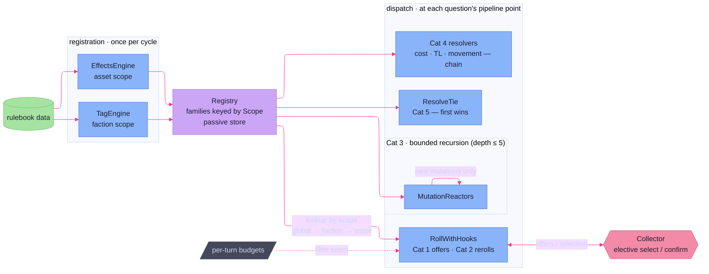

# Hooks

> **Code:** `internal/faction/engine/hooks/`, `internal/faction/engine/hooks/dispatch/`

## Purpose

Hooks are how a faction's tags and an asset's special features bend the rules of
a turn without the core engine knowing they exist. The package defines **five
families of reactive mechanic** — pre-roll dice augmentation, post-roll rerolls,
post-mutation reactions, query-time rule alterations, and tie-breaks — plus a
single `Registry` that binds each registered hook to a **scope** (global, a
faction, or one asset instance). The [tag and effect engines](effect-mutation.md)
*register* hooks from rulebook data at cycle start; the orchestrator and the
sub-engines *dispatch* them at the exact points in the pipeline where each
question gets asked. This page is the home for the hook taxonomy, the scope
lookup, and the dispatch model; the registrar side lives on the
[effect & mutation](effect-mutation.md) page.

## Shape

A hook's life has two halves that never meet directly: **registration** writes
an implementation into the registry under a scope; **dispatch** reads it back out
at a pipeline point and runs it. The registry is the only thing the two halves
share, and it is a passive store — it never calls a hook itself.

### The five categories

`doc.go` is the canonical outline; the categories are numbered for shorthand
(a tag is described as exercising "Cat 1 + Cat 5," etc.):

| # | Interface | Fires | Dispatched from |
|---|-----------|-------|-----------------|
| 1 | `RollModifier` | before a roll — offers extra dice / keep-highest | `RollWithHooks` (combat, in [actions](actions.md)) |
| 2 | `RollResultHook` | after a roll — may reroll specific dice | `RollWithHooks` (combat) |
| 3 | `MutationReactor` | after a phase's mutations — may emit more | orchestrator, after movement & action |
| 4 | `RuleModifier` family | at a rule query — alters the answer | the query site (purchase, bookkeeping, movement) |
| 5 | `TieResolver` | at an attack/defense tie | `ResolveTie` (combat) |

Category 4 is not one interface but a **typed family** — `AssetCostModifier`,
`MaintenanceCostModifier`, `WorldTechLevelModifier`, `AssetMovementGranter` —
each with its own signature (`ModifyAssetCost(buyer, def, world, baseCost) int`
and so on). They are split rather than folded into one generic
`Modify(any) any` precisely so the compiler keeps each question's argument and
return types honest; see Key Decisions.

### The registry and scope lookup

`Registry` holds one `map[Scope][]Registered…` per category. A `Scope` is a
comparable struct — a `ScopeKind` (Global / Faction / Asset) plus an optional
faction ID and asset-instance ID — so it works directly as a map key:

```go
type Scope struct {
	Kind            ScopeKind
	FactionID       string
	AssetInstanceID string
}
```

Registration is `registry.Register<Category>(scope, source, hook)`; the `source`
string (e.g. a tag or asset name) is carried only for diagnostics. Lookup is the
mirror — `registry.<Category>For(factionID, assetInstanceID)` — and it returns
matches in a **fixed precedence: global hooks first, then faction-scoped, then
asset-scoped, in registration order within each bucket.** Asset scope is only
consulted when an asset-instance ID is supplied, so a faction-level query never
accidentally drags in per-asset hooks. This ordering is the whole contract a
dispatcher relies on: it can walk the returned slice and trust that broader-scope
hooks act before narrower ones.

### Registration in, dispatch out

The registry is populated once, at the start of each cycle, by the two
registrars on the [effect & mutation](effect-mutation.md) page: `TagEngine`
registers faction-scoped hooks from the tags a faction holds, `EffectsEngine`
registers asset-scoped hooks from each asset's `S`-flag features. Nothing else
writes to the registry, and neither registrar ever dispatches.

Dispatch is the opposite of centralized. There is no single "run all hooks"
call; instead each category is consulted **at the pipeline point where its
question is genuinely being asked**, by the `dispatch` sub-package:

- **`RollWithHooks`** wraps every combat roll ([attack action](actions.md)).
  It gathers Cat 1 offers, hands them to the [collector](#the-collector-seam) for
  selection, expands and rolls the dice pool, applies keep-highest, then runs Cat
  2 reroll directives — so one call covers both roll-time families.
- **`MutationReactors`** runs after the orchestrator applies a phase's mutations
  (movement and action phases), letting Cat 3 reactors respond to what just
  happened.
- **`ResolveAssetCost` / `ResolveMaintenanceCost` / `ResolveWorldTechLevel` /
  `GrantedMovementAbilities`** are the Cat 4 query resolvers, called from
  [`buy_asset`](actions.md), [`bookkeeping`](turn-pipeline.md), the TL-gate on
  purchase, and the movement phase respectively. Each **chains** its modifiers —
  every modifier sees the previous one's output — so two effects on the same
  number compose instead of clobbering.
- **`ResolveTie`** is consulted at a combat tie, asking the attacker's resolvers
  first and the defender's only if the attacker has none; **first registration
  wins** (ties are a binary outcome, so there is nothing to chain).

Every resolver treats a `nil` registry and an empty match list as "no
modification" — pass the base value straight through — so a campaign with no
hooks behaves exactly like one whose hooks all decline.

### The collector seam

Roll-time hooks are the one family that needs a human (or planner) in the loop,
because some modifiers and rerolls are *elective*. The dispatcher reaches the
driver through a narrow `Collector`:

```go
type Collector interface {
	SelectModifiers(offers []ModifierOffer) []ModifierOffer
	ConfirmReroll(directive RerollDirective) bool
}
```

This is the hook-level slice of the engine's [collectors-in seam](orchestrator.md):
the dispatcher offers the full Cat 1 modifier list and the collector returns the
subset to apply; for each *elective* Cat 2 directive the collector confirms or
declines. Non-elective directives apply automatically.

### Per-turn budgets

A modifier or reroll may carry a `BudgetKey` (namespaced, e.g. `"tag:Warlike"`).
Once spent it increments `faction.HookBudgets[key]`, and the dispatcher filters
out any offer or directive whose budget is already non-zero this turn — the
mechanism behind "once per turn" effects like Warlike's bonus attack die. An
empty `BudgetKey` means unlimited. The budget map is reset each turn by
[bookkeeping](turn-pipeline.md), so the gating is per-faction-turn, not
per-cycle.

### Bounded recursion

Only **Cat 3 reactors recurse**: a reactor's emitted mutations can themselves
trigger reactors. `reactDispatch` bounds this at **depth 5** and trips an error
on overflow rather than looping forever. Critically, each level recurses on
**only the newly emitted mutations**, not the accumulated set — so a reactor
never re-fires on the mutations that triggered it, and the accumulated result is
built back up on the way out of the recursion. The other four families are
single-shot by construction.



## Key Decisions

- **Category 4 is a typed family, not a generic interface.** Each rule query
  (asset cost, maintenance, world TL, movement grants) has different argument and
  return types, so a single `Modify(any) any` would throw away compile-time
  safety. Four small interfaces keep every call site honest. (`doc.go`; frozen
  log 158–188.)
- **Scope is a comparable struct used directly as a map key.** Global / faction /
  asset identity collapses into one value type, so the registry is just maps and
  lookup is a fixed global→faction→asset walk — no per-category routing logic.
- **Dispatch is distributed, not centralized.** There is no "run all hooks" beat.
  Each category is consulted at the pipeline point where its question is asked
  (rolls in combat, reactors after a phase, cost modifiers at purchase and
  bookkeeping). A hook only runs where it is meaningful, and adding a dispatch
  site is a local change.
- **Only Cat 3 recurses, bounded at depth 5, on new mutations only.** Reactions
  can cascade, so they need a depth bound; recursing on just the newly emitted
  mutations stops a reactor re-firing on its own trigger, and the cap trips an
  error instead of hanging the turn. The other families cannot recurse.
- **Cat 4 modifiers chain; Cat 5 resolvers do not.** Cost-style answers compose
  (each modifier sees the prior result), so several effects stack. A tie is a
  single binary outcome, so the first registered resolver wins and the rest are
  ignored.
- **The collector seam keeps elective hooks out of the engine's hands.** Roll
  modifiers and elective rerolls are offered to the driver; the engine never
  decides them itself. This is the same source-agnostic collector contract the
  rest of the engine uses, narrowed to two methods.

## Dependencies

**Depends on** [`domain`](effect-mutation.md) (mutations, `Faction`, `Asset`,
roll types), [persistence & static data](persistence.md) (`FactionState` and the
`Rulebook` that hooks read at dispatch), and a `Collector` supplied by the
driver. The package defines the contracts; it owns no game data of its own.

**Registered by** the tag and effect engines on the
[effect & mutation](effect-mutation.md) page — the only writers to the registry.
**Dispatched by** the [orchestrator](orchestrator.md) (Cat 3 reactors after
movement and action), the [actions](actions.md) engine (Cat 1/2/5 in combat, Cat
4 asset-cost at purchase), and the [turn pipeline](turn-pipeline.md) (Cat 4
maintenance-cost at bookkeeping). Emitted reactions flow back through the same
[mutation apply layer](effect-mutation.md) as every other state change.
