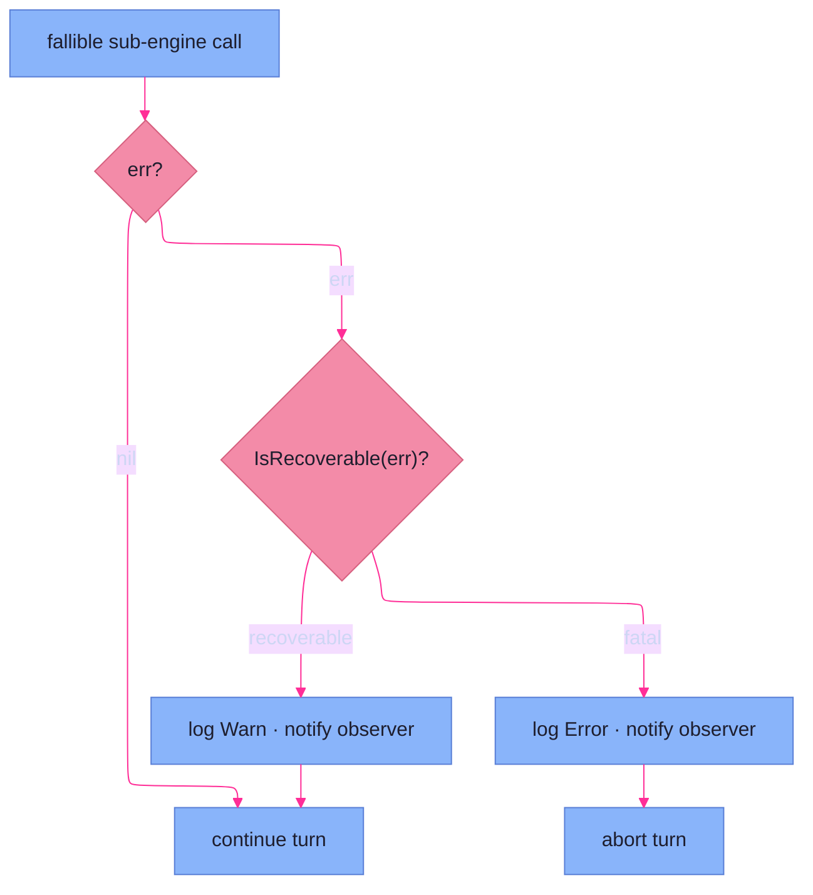

# Logging & Errors

> **Code:** `internal/logging/`, `internal/faction/errors/recoverable.go`

## Purpose

Two small subsystems share this page because they shipped together and answer two
halves of one question: *how does the engine narrate what it's doing, and what
counts as failure?* The `logging` package is a custom `slog` handler that turns
the engine's structured log calls into a human-readable, per-campaign run log
with banners. The `errors` package is the **recoverable-error classifier** — the
sentinel list that tells the [orchestrator](orchestrator.md) which errors are
gameplay outcomes (warn and continue) versus engine failures (abort the turn).
The classifier defines the orchestrator's abort semantics, so it lives beside the
logging it drives rather than orphaned in a generic errors grab-bag.

## Shape

### The per-campaign run log

`logging.New(logsDir, debug)` opens a fresh timestamped log file under the
campaign's `state/logs` ([persistence](persistence.md) owns the path), points a
best-effort `latest.log` symlink at it, and prunes old runs down to the most
recent 50. `debug` raises the level to `Debug` and turns on source annotation.
Everything is per-campaign, so a campaign's logs travel with its data.

### The custom handler

The handler implements `slog.Handler` but renders for *humans reading a session*,
not machines parsing JSON:

- **Flat `key=value`, no nesting.** `WithGroup` is intentionally a no-op — the
  handler renders one flat line, never grouped structure. `WithAttrs` accumulates
  context attrs that prefix later records.
- **A line is** `time  LEVEL  [file:line]  message  key=value…`, with the source
  location shown only when `debug`/`addSource` is on, and values quoted only when
  they contain whitespace or quotes.
- **Banners for structure.** When a record carries a `_banner` attr, the handler
  renders one of three shapes instead of a line: a multi-line **header** (tool,
  version, campaign, faction count, start time), a boxed **turn** banner
  (`Turn N · Faction`), and a **phase** rule (snake_case phase name rendered Title
  Case). The `logging.RunHeader` / `TurnStart` / `PhaseStart` helpers emit them.

The handler also **suppresses a fixed set of attr keys** (`_banner`, `turn`,
`faction`, `phase`) from normal lines. This is the visible half of the engine's
two-channel logging convention: those keys are the *cascaded context* the
orchestrator threads through every sub-engine call, and they are shown once, as
banners, rather than repeated on every line beneath them.

### The two-channel logger

The convention itself lives across the engine (and is summarized on the
[engine overview](overview.md)): each sub-engine holds a `log` **field** for its
own internals *and* takes a `log` **parameter** on its phase methods, which the
orchestrator cascades with `.With("phase", …)` / `.With("engine", …)`. So a line
emitted during a sub-engine call is tagged with both the phase and the engine —
and because the handler suppresses `phase`/`turn`/`faction` from the line body,
that tagging reads as the surrounding banners, not as noise on every row.

### The recoverable-error classifier

`recoverable.go` is the whole of the error subsystem — a list and a predicate:

```go
var recoverableErrors = []error{
	action.ErrNoSelection,
	action.ErrTurnCanceled,
	action.ErrActionUnavailable,
}

func IsRecoverable(err error) bool // errors.Is against the list
```

A **recoverable** error is one the orchestrator treats as a gameplay outcome: at
every fallible step it branches on `IsRecoverable(err)`, and a match logs at
**Warn**, notifies the observer, and **continues past the failing sub-engine
call**; anything else logs at **Error**, notifies, and **aborts the turn**. The
three sentinels are exactly the "the GM declined / cancelled / had nothing to do"
outcomes that surface from [actions](actions.md) — not failures, just turns that
do less. The list's doc comment makes the rule explicit: adding to it is a
deliberate change to the orchestrator's abort semantics, never a casual catch-all.



## Key Decisions

- **The handler renders for humans, not machines.** Flat `key=value` lines and a
  no-op `WithGroup` keep a session log skimmable; there is no JSON consumer to
  serve, so nesting would only add noise.
- **Structural context becomes banners, not repeated attrs.** `turn`, `faction`,
  `phase`, and `_banner` are suppressed from line bodies and rendered as headers
  and rules, so the cascaded context that tags every record shows up once as
  visual structure instead of cluttering each line. (Frozen log 241–250.)
- **Sub-engines log on two channels.** A `log` field for internals plus a cascaded
  `log` parameter for orchestrator-driven calls means every line carries both its
  engine and its phase, without a sub-engine needing to know the phase it runs in.
  (Frozen log 241–250; see [overview](overview.md).)
- **Logs are per-campaign and self-pruning.** Each campaign keeps its own
  timestamped run logs with a `latest.log` symlink and a 50-file retention cap, so
  logs are co-located with the data they describe and never grow unbounded.
- **The recoverable list is the deliberate definition of abort semantics.** Which
  errors degrade a turn versus abort it is one explicit sentinel list checked with
  `errors.Is`, not scattered `if`-checks. Extending it is a conscious decision
  about engine behavior. (`recoverable.go` comment.)
- **The error half lives with the logging half.** The classifier shipped with the
  logging initiative and exists to drive the orchestrator's warn-vs-abort logging
  branch; keeping the two together avoids orphaning a three-line package.

## Dependencies

**Logging depends on** only the standard library (`log/slog`, `os`) and
receives its `LogsDir` from [persistence & static data](persistence.md). **The
classifier depends on** the [actions](actions.md) package for the sentinel
values it matches.

**Depended on by** the [orchestrator](orchestrator.md) above all — it constructs
the logger, emits the banners, cascades the two-channel context, and calls
`IsRecoverable` at every phase boundary. Every engine subsystem receives a
`*slog.Logger` from it. The classifier is consumed only by the orchestrator's
recoverable-vs-fatal branch.
