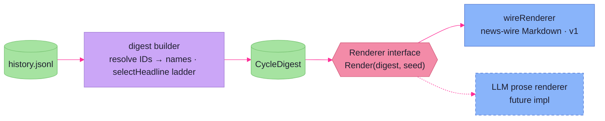

# Narrative Digest

> **Code:** `internal/faction/narrative/`, `internal/faction/narrative/digest/`

## Purpose

The narrative system turns a cycle's mechanical history into readable prose —
the "what happened this cycle" recap. It is **post-hoc**: it reads the
append-only history log after the fact rather than listening to live events, and
it runs in two layers separated by a stable intermediate. The
[`digest`](#the-digest-builder) layer folds raw history into a typed
`CycleDigest`; the [`Renderer`](#the-renderer-seam) layer turns that digest into
text. The seam between them is the whole design: the digest is presentation-
agnostic, so renderers can multiply without touching the analysis.

Both layers are **built and unit-tested but not yet wired to any frontend** —
nothing in `cmd/` or the TUI currently surfaces a recap. Exposing it (a CLI
command and/or a TUI view) is tracked as `F.021` in
[planned-work](../../dev_journals/faction-manager/planned-work.md). The page below
describes the engine-side machinery that exists today.

## Shape

The flow is a straight pipeline, history at one end and prose at the other:

```
history.jsonl ──LoadCycle──▶ []EventRecord ──digest.Build──▶ CycleDigest ──Renderer.Render(seed)──▶ string
```

`LoadCycle` (`history_reader.go`) opens the campaign's `history.jsonl`
([persistence](persistence.md) owns its path), scans it line by line, and
returns the `EventRecord`s whose `Cycle` matches — the input slice for one
recap. Everything downstream operates on that slice; nothing reaches back into
live engine state for events.

### The digest builder

`digest.Build` is the analytical core, and it is essentially the **inverse of
the [mutation apply layer](effect-mutation.md)**. Where `Apply` atomizes a game
event into individual mutations, `Build` re-aggregates those mutations back into
human-meaningful events:

- It folds each record into a **`FactionBeat`** per acting faction — Coin/HP/XP
  deltas, acquisitions, losses, movements, goal events, stealth ops — keyed by
  faction so a cycle's worth of records collapses into one beat each.
- Several mutation types **pair into one composite event**: a repair is an
  `asset_hp_delta` plus its `coin_delta`, an expansion bundles base HP and cost,
  a refit's `asset_removed` is pre-scanned so the paired `asset_added` can name
  what it replaced. Per-record accumulators do this stitching.
- Cross-faction interactions become **`CrossEvent`s**. `findCrossTarget` spots
  the first mutation in a record aimed at a faction other than the actor and
  routes the record into a shared attacker/defender event (damage both ways, base
  hits, destruction, Coin drained). The deliberate limitation — only the *first*
  cross-target per record is detected — is documented at the function, because no
  current action targets two factions at once.
- Inactive factions are split out into **`QuietFactions`** by `isQuiet` (no
  beats, no cross involvement), so the recap can name who did nothing without
  manufacturing filler for them.

Throughout, IDs become **display names** via `resolve.go`, which looks them up in
[faction state](persistence.md) and the [rulebook](persistence.md) and falls back
to the bare ID when the entity is already gone (a destroyed asset still needs a
name in the recap). The digest is the layer that *knows* names; the renderer
never does a lookup.

### The headline

`selectHeadline` picks the cycle's lead story from a fixed **priority ladder** —
Major Attack → Goal Completed → Faction Destroyed → Homeworld Shift → Goal
Abandoned → Quiet — with deterministic tie-breaks (highest combined damage, then
faction name; highest XP, then name). The result is a small `Headline{Subject,
Kind, Detail}` the renderer dresses up. Because the rule is total and
tie-breaks are by name, the same history always yields the same headline.

### The renderer seam

`Renderer` is a one-method interface:

```go
type Renderer interface {
	Render(cycleDigest digest.CycleDigest, seed int64) (string, error)
}
```

The shipped `wireRenderer` (a news-wire style, v1) renders Markdown: a headline,
a lede, a section per active faction, and a quiet tail. Its variety comes from
**seeded randomness** — `rand.NewSource(seed)` drives `pick` over template lists
keyed by `HeadlineKind` and event shape, so copy reads differently cycle to cycle
but the *same* `(digest, seed)` always produces byte-identical text. Templates
live in `wire_templates.go` and use `{name}`/`{detail}` placeholders. A second
renderer (terse log, LLM-driven prose) would implement the same interface against
the same digest and need no change to the builder.



## Key Decisions

- **Narrative is post-hoc, derived from history.** The recap reads the
  `history.jsonl` log rather than subscribing to live events, so it can be
  regenerated any time, for any past cycle, and the engine carries no narrative
  concern during a turn. (Frozen log 84–89.)
- **The `CycleDigest` is a stable, presentation-agnostic intermediate.** All
  analysis — folding mutations into beats, pairing composite events, resolving
  names, picking the headline — happens once, in the builder. Renderers consume
  the digest and only shape text, so new output formats multiply without
  re-deriving meaning.
- **The builder inverts the apply layer.** `Apply` turns events into atomized
  mutations; `Build` re-aggregates mutations into composite human events. Keeping
  that re-aggregation in one place is what lets the rest of the engine emit
  fine-grained mutations without worrying how they read.
- **Names are resolved in the digest, with ID fallback.** IDs become display
  names once, in the digest, and fall back to the raw ID when the entity is gone
  — so a destroyed asset or deleted faction still renders sensibly and the
  renderer never touches state.
- **Headline selection is a total priority ladder with name tie-breaks.** A fixed
  precedence and deterministic ties make the lead story reproducible from the
  same history.
- **Renderer variety is seeded, not random.** A `seed` drives template choice, so
  prose varies between cycles yet is exactly reproducible for a given seed —
  testable copy that still reads as written, not generated.

## Dependencies

**Depends on** [`domain`](effect-mutation.md) (`EventRecord` and the mutation
payloads it unmarshals), [persistence & static data](persistence.md) (the
`history.jsonl` it reads, plus faction state and the rulebook for name
resolution). The `digest` package holds no rendering logic; `narrative` holds no
analysis.

**Depended on by** nothing in production yet — only tests exercise `LoadCycle`,
`Build`, and the renderer. A future recap surface (`F.021`) on the
CLI/[interface](../interface/overview.md) side will be the first consumer,
loading a cycle, building its digest, and rendering it. Nothing in the turn
pipeline depends on narrative — it is a strictly downstream reader of the history
the [turn pipeline](turn-pipeline.md) writes.
