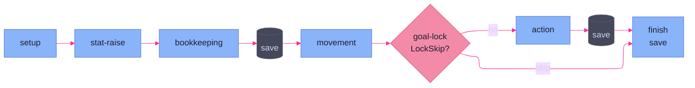
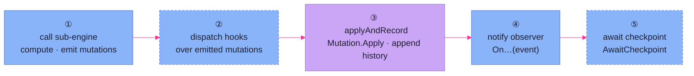

# Orchestrator

> **Code:** `internal/faction/engine/{core,orchestrator,collector,observer,roller}.go`

## Purpose

The orchestrator is the composition root and turn driver for the faction
engine. `core.go` wires the `Engine` — the rulebook, a roller, a hook registry,
and seven sub-engines — and `orchestrator.go` drives one faction's turn through
a fixed sequence of phases, delegating the mechanics of each phase to a
sub-engine and owning everything between them: hook dispatch, mutation
application, history, persistence, and the pause points where a caller steps in.
If you are tracing how a turn actually runs end to end, this is the page.

## Shape

### The composition root

`Engine` (`core.go`) holds the rulebook plus the nine collaborators the
pipeline calls into:

```go
type Engine struct {
	Rulebook *rulebook.Rulebook
	Rand     domain.Roller
	Hooks    *hooks.Registry
	Turn     *turn.TurnEngine
	Tag      *tag.TagEngine
	Effect   *effect.EffectsEngine
	Mutation *mutation.MutationEngine
	Action   *action.ActionEngine
	Goal     *goal.GoalEngine
	World    *world.WorldEngine
	log      *slog.Logger
}
```

`NewWithRulebook` constructs every sub-engine in one pass, then performs the two
data-driven registration steps that turn rulebook content into runtime hooks:
it registers a `TransportHandler` for each asset definition carrying a
`Transport` profile, and calls `RegisterDefaultActions` with the explicit deps
the action factories need. The `World` engine is passed in rather than built
here — it is constructed against the campaign's spatial map before the faction
engine exists.

### Two cycle loops

`RunCycle` is the entry point. It logs a run header, primes the cycle's
data-driven hook layer once, up front — `Tag.ApplyAll` registers hooks keyed off
faction state, `Effect.ApplyAll` off rulebook asset data — then loops
`RunFactionTurn` until a turn reports the cycle closed out. The caller must have already called `Turn.Start` (or be
resuming an in-progress turn); the orchestrator does not open the cycle, it runs
it.

`RunFactionTurn` drives a single faction through the pipeline and returns
`(cycleDone bool, err error)`. The boolean reports whether advancing the turn
cursor past this faction closed the cycle — that is the signal `RunCycle` loops
on. The fixed phase order:



Each phase delegates its mechanics to a sub-engine, then runs the same
five-step beat around that call — zoomed in below:



Setup rebuilds the world index and resolves the current faction. Goal-lock runs
immediately before the action phase it gates: a `LockSkip` goal lock short-circuits
past action straight to finish. State is
saved at two interior gates (after bookkeeping, after action) and again in
finish — never mid-phase.


### The per-phase beat

Each phase function (`runGoalLockPhase`, `runBookkeepingPhase`, … ) is a
variation on one beat:

1. **Call the sub-engine** for this phase's mechanics (e.g.
   `Goal.CheckLock`, `Turn.ApplyBookkeeping`, `World.TickMovementOrders`,
   `Action.Run`). Sub-engines compute and *emit mutations*; they never touch
   state directly.
2. **Dispatch hooks** over the emitted mutations where the phase has reactive
   rules — `dispatch.MutationReactors` in the movement and action phases.
3. **Apply and record** via `applyAndRecord`: apply the mutations to in-memory
   state through `Mutation.Apply`, then append one `EventRecord` to the history
   file.
4. **Notify the observer** of what happened (`OnBookkeepingApplied`,
   `OnMovementResolved`, … ).
5. **Await a checkpoint** where the phase is a GM pause point
   (`collectors.Phase.AwaitCheckpoint`).

This beat is a synthesis, not a literal invariant. Phases vary in both which
steps they have and their order: goal-lock has no hook dispatch and notifies the
observer *before* applying; the action phase folds goal-progress mutations into
the action's own before dispatching. What is uniform is the recoverable-vs-fatal
handling wrapped around every fallible step (see Key Decisions).

### The two input contracts

`collector.go` defines the seam to whoever is driving the turn — GM, AI, or a
test:

```go
type Collectors struct {
	Phase  PhaseCollector  // orchestrator-owned prompts
	Action action.Collector // threaded to sub-engines
}
```

`PhaseCollector` is the orchestrator's own prompt surface: `AwaitCheckpoint`,
`SelectAction`, `SelectStatRaise`, `SelectMovementDecisions`,
`SelectTransportCargo`. `action.Collector` is a separate, richer contract passed
down into the action sub-engine (it transitively satisfies `hooks.Collector` and
`ability.Collector`). The orchestrator threads both but calls only `Phase`
itself.

### The output channel

`observer.go` defines `TurnObserver`, the engine's fire-and-forget output
channel: one `On…` method per pipeline event. The engine never waits on the
observer and the observer cannot affect game state — it exists for display,
logging, and narration. Errors do **not** flow through the observer as the
control path: every phase function *returns* its error to `RunFactionTurn`,
which returns it to `RunCycle` and out to the caller. `OnError` is fired
alongside the return purely so observers can react; the caller's `err` is the
source of truth.

### applyAndRecord and the save cadence

`applyAndRecord` is the single choke point for state change: it applies a
mutation batch and appends history, and it deliberately does **not** persist to
disk. `Mutation.Apply` reports per-mutation misses, which the orchestrator logs
before failing. `state.Save` is called only at phase gates — after bookkeeping,
after action resolution, and in `finish` — so a turn's on-disk state always
lands on a phase boundary, never inside one.

## Key Decisions

- **Single-pass, self-registering construction.** `NewWithRulebook` builds every
  sub-engine and registers its data-driven hooks in one call rather than a
  staged bootstrap. The engine owns its own wiring; callers hand it a rulebook
  and a world engine and get a ready engine back. (Resolves R-012; frozen log
  285–294.)
- **Two input contracts, split by audience.** `PhaseCollector` is the
  orchestrator's own prompt surface (checkpoints, action/stat/movement/cargo
  selection); `action.Collector` is a separate, richer contract threaded down
  into the action sub-engine, where it transitively satisfies `hooks.Collector`
  and `ability.Collector`. They are kept distinct because they serve different
  callers — the orchestrator drives `Phase`, the sub-engines consume `Action`.
  (Frozen log 46–53.)
- **Fire-and-forget observer; errors return.** `TurnObserver` is output-only and
  cannot change state; the control path for failure is the returned `error`.
  Internal packages return errors and the caller (here, the orchestrator)
  forwards them to the observer — the engine never depends on an observer for
  correctness. This is the error-return-over-observer rule.
- **Recoverable-vs-fatal branching at every fallible step.** Every sub-engine
  call, mutation apply, and checkpoint is wrapped in the same branch:
  `factionErrors.IsRecoverable(err)` → warn, fire `OnError`, and continue (or
  return `nil` to pause without aborting); otherwise log, fire `OnError`, and
  return the wrapped error. Recoverable failures degrade the turn; fatal ones
  abort it. (See [logging & errors](logging-errors.md) for the classifier.)
- **`applyAndRecord` does not save.** Mutation application and history append are
  decoupled from disk persistence. `state.Save` runs only at phase gates, so
  durable state always reflects a completed phase. (Frozen log 195–196.)
- **Checkpoints are the named pause points.** The `Checkpoint*` constants
  (`bookkeeping`, `movement`, `action_result`, `goal_locked`, `cycle_summary`)
  enumerate where the orchestrator yields to `AwaitCheckpoint`. A GM-driven
  caller blocks there for acknowledgement; an AI or test caller returns
  immediately. The pause points are part of the contract, not an interface
  artifact.
- **Goal-lock sits adjacent to the phase it gates.** Goal-lock runs immediately
  before the action phase rather than at the top of the turn. A `LockSkip` is
  precisely the signal to short-circuit past action straight to finish, so the
  lock decision belongs next to what it controls; its earlier position was
  incidental ordering, not a dependency — no phase between setup and action
  consumes the lock.
- **The orchestrator owns the inter-phase work, sub-engines own the mechanics.**
  Sub-engines emit mutations and never mutate state; hook dispatch, mutation
  application, history, persistence, and checkpoint handling all live in the
  orchestrator. This keeps mutations the only state-change currency and keeps
  sub-engines independently testable.

## Dependencies

**Depends on** every engine subsystem: [turn pipeline](turn-pipeline.md)
(cursor, bookkeeping, history), [actions](actions.md),
[goals](goals.md), [effect & mutation](effect-mutation.md) (apply layer + tag/
effect registration), [hooks](hooks.md) (dispatch), and
[world & movement](world-movement.md) (index rebuild, movement orders). It also
calls [persistence & static data](persistence.md) for `state.Save` and the
rulebook, and [logging & errors](logging-errors.md) for the run header and the
recoverable-error classifier.

**Depended on by** the [interface](../interface/overview.md) side: the
[event stream](../interface/event-stream.md) adapter constructs the `Collectors`
and a `TurnObserver`, runs the engine on a goroutine, and calls `RunCycle`. Any
future frontend (CLI, web) drives the engine through these same two seams.
