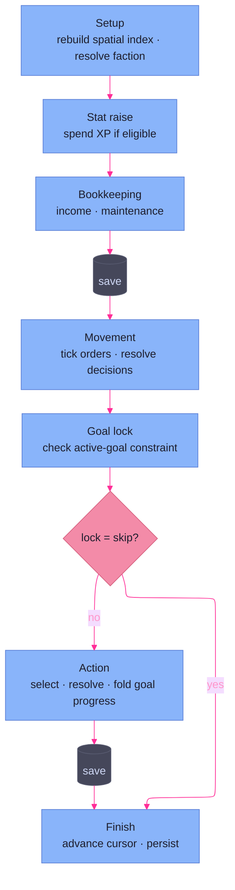

# Engine — Overview

> The engine side's spine. Cross-subsystem narrative plus the page index.
> Anything about a single subsystem lives on that subsystem's page; only
> narrative that spans subsystems lives here.

## What the engine is

The engine is the SWN faction-turn system: a composition root
(`engine.Engine`) owning a rulebook, a roller, a hook registry, and seven
sub-engines (turn, tag, effect, mutation, action, goal, world), driven by a
phase-oriented orchestrator. Sub-engines compute the mechanics of a turn and
*emit mutations*; the orchestrator sequences them, applies the mutations, and
records history.

The engine is **headless by design.** It talks to whatever drives it through
exactly two interfaces — a collector supplying decisions in, a fire-and-forget
observer reporting events out — and knows nothing about who is on the other
side. That seam is what lets one engine back three different drivers: the
scripted **test harness**, the interactive **UI** (TUI today, CLI and other
frontends later), and the eventual **AI planner**. None is privileged; the
engine cannot tell them apart.

 

## AI Decision-Making (Planned)

Because the collector seam is source-agnostic (above), an automated planner can
drive faction turns through the same interface the GM uses — nothing in the
engine distinguishes them. The intent is traditional game AI (not LLM-based), in
two planned modes:

- **Goal-oriented** — plays optimally toward the faction's current goal
- **In-character** — factors in faction personality and tags

This is a forward-looking property of the seam, not yet-built behavior.

 

## How a cycle runs

A cycle is one pass of every faction through its turn. The orchestrator's
`RunCycle` primes the cycle's data-driven hooks once (tag and effect handlers,
below), then loops a single faction's turn until the rotation closes out. Each
faction turn runs a fixed phase sequence, every phase delegating its mechanics
to the page named beside it:

1. **Setup** — rebuild the per-turn spatial index ([world & movement](world-movement.md))
   and resolve the current faction ([turn pipeline](turn-pipeline.md)).
2. **Stat raise** — spend XP to raise a stat if eligible (orchestrator-owned,
   drawing on faction XP).
3. **Bookkeeping** — income and maintenance ([turn pipeline](turn-pipeline.md)),
   then save.
4. **Movement** — tick in-flight orders and resolve new movement decisions
   ([world & movement](world-movement.md)), with reactor hooks
   ([hooks](hooks.md)) firing on the emitted mutations.
5. **Goal lock** — check whether the active goal constrains or skips the turn
   ([goals](goals.md)).
6. **Action** — pick and resolve one action ([actions](actions.md)), fold in
   goal-progress mutations ([goals](goals.md)), dispatch reactors
   ([hooks](hooks.md)), then save.
7. **Finish** — advance the turn cursor ([turn pipeline](turn-pipeline.md)) and
   persist ([persistence & static data](persistence.md)).

A goal lock of the *skip* kind short-circuits past the action phase. Every
phase applies its mutations through the same path — the
[effect & mutation](effect-mutation.md) apply layer — and the
[orchestrator](orchestrator.md) page covers the per-phase beat and its
error handling in full.

 

## Cross-subsystem conventions

Patterns that recur across engine subsystems, each verified in source:

- **Handler registries keyed by a data ID.** Three sub-engines hold a
  `map[string]Handler` populated up front and looked up by a rulebook ID at
  runtime: **tag** (keyed by tag ID), **effect** (by asset-definition ID), and
  **goal** (by goal ID). The [actions](actions.md) engine is kin but distinct —
  an ordered `[]ActionFactory` filtered by `Validate` rather than keyed by ID —
  and the [hooks](hooks.md) registry is keyed by `Scope`, not a data ID.
- **Data-only TOML entries are silently and intentionally skipped.** The flip
  side of keyed lookup: a tag, asset, or goal present in the TOML with no
  registered Go handler is a no-op, not an error (`tag.go` carries the
  fence-sign: *"Data-only tag … no Go handler registered. Intentional."*). This
  is how a GM adds flavor data without touching code.
- **Mutations are the only state-change currency.** Sub-engines never mutate
  state directly — they return `[]domain.Mutation`. The orchestrator applies
  them through one choke point (`applyAndRecord` → `Mutation.Apply`), so every
  state change is recordable and replayable. See
  [effect & mutation](effect-mutation.md).
- **Collectors in, observer out.** A turn's driver is wired through two
  interfaces: a `PhaseCollector`/`action.Collector` pair supplying decisions
  *into* the engine, and a fire-and-forget `TurnObserver` reporting events
  *out*. The engine never depends on the observer for correctness. See
  [orchestrator](orchestrator.md).
- **Recoverable vs. fatal error discipline.** Every fallible step is wrapped in
  the same branch: a recoverable error degrades the turn (warn, notify, continue
  or pause); a fatal one aborts it. The classifier lives in
  [logging & errors](logging-errors.md).
- **Two-channel logging for sub-engines.** Each sub-engine holds a `log` field
  for its own internals and *also* takes a `log` parameter on its methods,
  which the orchestrator cascades with `.With("engine", …)` so a sub-engine call
  made during a phase is tagged with both the phase and the engine. See
  [logging & errors](logging-errors.md).
- **Save at phase gates, never mid-phase.** `applyAndRecord` applies mutations
  and appends history but does not persist; `state.Save` runs only at phase
  boundaries, so on-disk state always reflects a completed phase. See
  [persistence & static data](persistence.md).

 

## Page index

| Page | Scope | Status |
|------|-------|--------|
| [orchestrator](orchestrator.md) | Composition root; the phase pipeline and its per-phase beat | Written |
| [turn pipeline](turn-pipeline.md) | Turn lifecycle, bookkeeping math, rotation order, history | Written |
| [actions](actions.md) | The `Action` contract, factory registration, eligibility, abilities | Written |
| [goals](goals.md) | Per-goal handlers, the lock taxonomy, progress tracking | Written |
| [hooks](hooks.md) | The five hook categories, scope lookup, dispatch | Written |
| [world & movement](world-movement.md) | Per-turn spatial index and movement orders | Written |
| [spatial](spatial.md) | Region map, hex routing, pathfinding, the map builder | Written |
| [effect & mutation](effect-mutation.md) | Faction tags, asset effects, and the mutation apply layer | Written |
| [persistence & static data](persistence.md) | State/static-data TOML, campaign layout, history JSONL | Written |
| [narrative digest](narrative-digest.md) | History → typed digest → rendered narrative | Written |
| [logging & errors](logging-errors.md) | The custom slog handler and the recoverable-error classifier | Written |
