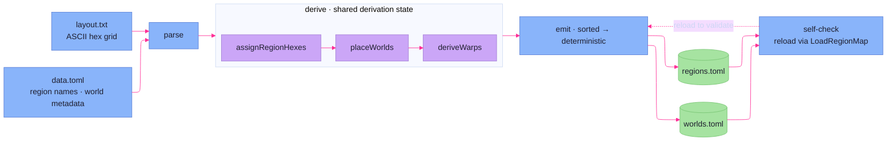

# Spatial

> **Code:** `internal/spatial/`, `internal/spatial/builder/`

## Purpose

The spatial package is the campaign's map. It has two halves that never run at
the same time: at **runtime**, a `RegionMap` answers the only three questions the
rest of the system asks — *what world is this*, *how far between two hexes*, and
*what path connects them* — behind a deliberately narrow interface; at
**authoring time**, an offline `builder` derives the canonical map data from a
human-drawn ASCII hex grid. The package is **engine-agnostic by design**: it
imports no faction code and knows nothing about assets, turns, or mutations. The
[world engine](world-movement.md) is its only in-engine consumer, reaching it
through the `HexRouter` seam.

## Shape

### The interface ladder

`spatial.go` defines three interfaces in widening specificity, and this narrowing
is the package's primary contract:

```go
type SpatialMap interface { Location(id string) (Location, bool) }

type Location interface { ID() string; Name() string; TechLevel() int; Population() int }

type RegionLocation interface {
	Location
	Coords() (q, r int)
	RegionID() string
	RegionHex() RegionHex
}
```

A consumer that only needs to *resolve* a world ID depends on `SpatialMap`; one
that needs hex coordinates depends on `RegionLocation`. The concrete `World` and
`RegionMap` satisfy these (asserted with `var _` blocks), but callers hold the
interface, not the struct. The routing currency throughout is **`RegionHex`** — a
`{RegionID, HexCoord}` pair — not a bare hex: a hex coordinate is only meaningful
relative to the region that owns it.

### RegionMap at runtime

`RegionMap` holds four maps: `regions` (each a named set of hexes), `worlds`
(placed entities), `hexIndex` (every hex → its owning region), and `warps` (the
inter-region jump links). `LoadRegionMap` reads two canonical TOML files —
`regions.toml` and `worlds.toml` — and validates as it goes: one region per hex
(a hex claimed twice is an error), every warp endpoint actually lies in its
declared region, and every world sits on a hex its region owns. The map is
immutable once loaded; nothing mutates it during a turn.

**Warps are stored bidirectionally.** The source data declares each warp once, in
canonical orientation, but `newRegionMap` expands it into two `warpLink` entries
— `from→to` and `to→from` — so a lookup from either endpoint finds the jump. This
is why the runtime never has to worry about warp direction.

### Pathing

`Distance` and `Path` run **Dijkstra** over a graph built on demand by
`neighbors`: each hex connects to its six geometric neighbors at **cost 1**, plus
any warp links at the caller-supplied **`crossingCost`**. That crossing cost is
the seam to game rules — the [world engine](world-movement.md) passes
`rulebook.DriftCost(driftRating)`, so a route's price reflects the moving asset's
drift rating without spatial knowing what drift is. `Path` reconstructs the hex
sequence by walking the predecessor map back from the target and reversing it;
`Distance` returns just the cost. Both reject a negative crossing cost
(`ErrInvalidCost`) and report an unreachable target as `ErrNoPath` rather than a
zero. The package's sentinel errors (`ErrUnknownWorld`, `ErrNoPath`,
`ErrInvalidCost`) are its whole failure vocabulary.

### The offline builder

`builder/` is a separate authoring pipeline (driven by the spatial-map CLI), not
runtime code. `Build` runs a fixed sequence: **parse** a human-authored
`layout.txt` (an ASCII hex grid) and `data.toml` (region names + world
metadata), **derive** the canonical map, **emit** `regions.toml`/`worlds.toml`,
then **self-check** by reloading the output through `LoadRegionMap` — if the
canonical output won't load, that's an internal bug, surfaced as one.

The `layout.txt` grid is the ergonomic heart: each glyph is a cell — `A`–`Z` a
region, `1`–`9`/`a`–`z` a world marker, `.` empty — and a trailing `*` marks a
hex as a warp anchor. Odd rows carry a one-space render indent that the parser
strips. `derive` then runs as phases over a shared `derivation` state struct:

1. **`assignRegionHexes`** — every region-letter cell becomes one of its region's
   hexes (offset grid coords converted to axial).
2. **`placeWorlds`** — each world marker is placed, with its region either
   declared explicitly or **inferred from its neighbors** (ambiguous or
   neighborless markers are a hard error telling the author to add `region = "X"`).
3. **`deriveWarps`** — every pair of warp-marked boundary hexes in *different*
   regions with a clear hex line-of-sight (and more than one hex apart — adjacent
   marks already connect by an ordinary step) becomes a warp. Line-of-sight uses
   cube-coordinate hex line drawing (`geometry.go`); a mark that reaches no other
   region is a non-fatal warning, not an error.

The whole pipeline is **deterministic** — regions, worlds, warps, and marks are
all sorted before emit — so the same layout always produces byte-identical TOML.
A single `canonicalEdge` helper (alphabetically-first region owns the edge) is
shared between adjacency and warp derivation and fence-signed precisely because
both phases must agree on orientation.



## Key Decisions

- **The interface ladder narrows access.** `SpatialMap` / `Location` /
  `RegionLocation` let each consumer depend on the smallest surface it needs, and
  callers hold interfaces rather than the concrete `RegionMap`. (Frozen log
  218–226.)
- **`RegionHex` is the routing type.** Pathing and location speak in
  `{RegionID, HexCoord}`, never a bare hex, because a coordinate is only
  meaningful within its region — the same hex coord can exist in several regions.
- **The package is engine-agnostic.** Spatial imports no faction code; the rules
  coupling (what a crossing costs) enters only as the `crossingCost` *parameter*
  to `Distance`/`Path`. The map can be reasoned about, tested, and built with no
  engine present.
- **Warps are authored once, stored bidirectionally, canonically oriented.** Data
  declares a warp in one canonical orientation (alpha-first region); the runtime
  expands it to both directions and dedups on the canonical form, so direction
  never matters at lookup. (Frozen log 269–271.)
- **Derivation is a phased pipeline over a shared state struct.** `derive` threads
  a `derivation` value through assign → place → warp phases rather than reaching
  for generics or a re-derivable global, keeping each phase a plain method over
  explicit in-flight maps. (Frozen log 272–273.)
- **The builder self-checks its own output.** `Build` reloads the emitted TOML
  through the runtime loader before returning; a canonical file the runtime can't
  parse is treated as an internal bug, not user error.
- **Authoring is an ASCII grid, runtime is flat TOML.** Humans draw a hex map
  they can read; the build step compiles it to the indexed, validated form the
  runtime wants. The two representations are deliberately different shapes for
  their different jobs.

## Dependencies

**Depends on** nothing in the faction engine — only the standard library and the
TOML decoder. This isolation is the point.

**Depended on by** the [world engine](world-movement.md) through the `HexRouter`
seam (distance, pathing, world resolution); `RegionLocation` and `RegionHex` also
surface in [`domain.Location`](world-movement.md), which embeds a `RegionHex` as
an asset's coordinate. The offline `builder` depends on the runtime loader for
its self-check, but nothing at runtime depends on the builder.
