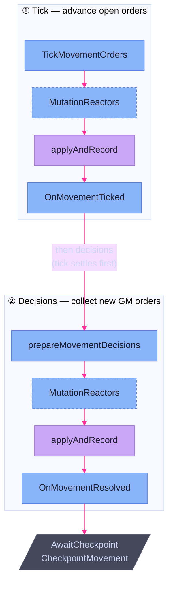

# World & Movement

> **Code:** `internal/faction/engine/world/`; movement-phase consumers in `internal/faction/engine/orchestrator.go`

## Purpose

The world engine answers two questions a faction turn needs: *where is
everything right now*, and *what is in transit between worlds*. It holds a
per-turn **spatial index** — a snapshot of every asset and base keyed by world
and by hex, rebuilt at the start of each faction's turn — and it owns
**movement orders**, the multi-turn transit records that tick a slow asset
across the map one speed-step at a time. It does the bookkeeping of *who moves
where*; it delegates the geometry of *how far* and *by what path* to the
[spatial](spatial.md) map through a single seam. Like every engine subsystem it
never writes state — it emits [mutations](effect-mutation.md).

## Shape

`engine/world/` is one package telling one story across two files: `world.go`
(the index and the spatial seam) and `movement.go` (orders). The orchestrator's
movement *phase* — the sequencing, hook dispatch, and GM prompts — lives beside
them in `orchestrator.go`, because it is pipeline orchestration, not world logic.

### The per-turn index

`RebuildIndex` walks the whole faction state once and produces an `Index`:

```go
type Index struct {
	AssetsByLocation map[string][]*domain.Asset   // settled assets, by world ID
	BasesByLocation  map[string][]*domain.Base     // bases, by world ID
	AssetsByHex      map[spatial.RegionHex][]*domain.Asset // every asset, by hex
}
```

The orchestrator rebuilds it at **setup, once per faction turn**, so every
later phase reads a current snapshot without re-scanning. The split between the
two asset maps is deliberate: an **in-flight** asset (one whose `Location` has an
empty `WorldID` — it is mid-drift between worlds) has no settled world, so it
appears in `AssetsByHex` but *not* in `AssetsByLocation`. Hex is the only
coordinate that is always meaningful; world membership is the thing that lapses
during transit.

A `Location` referencing a world the [spatial](spatial.md) map doesn't know is
**skipped, not fatal**: `RebuildIndex` collects the unknown world IDs and returns
them, and the orchestrator forwards them to `observer.OnIndexSkipped` so the
driver can surface "this asset is somewhere the map can't place." A typo in
campaign data degrades one entity, it doesn't abort the turn.

### The spatial seam

The world engine never imports the map's internals. It depends on a narrow
`HexRouter` interface — the read-only [`SpatialMap`](spatial.md) plus just
`Distance` and `Path` over `RegionHex` — and `spatial.RegionMap` is asserted to
satisfy it (`var _ HexRouter = (*spatial.RegionMap)(nil)`). This is the seam
named in the [engine overview](overview.md): movement asks the map for a route
and a cost and stays ignorant of how regions, warps, and crossing costs produce
them.

### Movement orders

A `domain.MovementOrder` is the durable transit record carried on the asset
(`asset.CurrentOrder`): its `Origin`, `Destination`, the full `Path` of hexes,
the current `StepIdx`, the `DriftRating` that priced the route, and the
`CargoAssetIDs` riding along. Orders move through two engine entry points:

- **`TickMovementOrders`** advances each asset with an open order by its
  `def.Speed` hexes. If the new step index reaches the end of the path it emits a
  `MovementOrderCompleted` (settling the asset at its destination); otherwise a
  `MovementOrderProgressed` carrying the new hex and step. Speed is hexes-per-
  turn, so a fast asset eats more of its path each tick.
- **`BuildMovementMutations`** turns GM **decisions** into order mutations. There
  are three kinds: **Issue** paths from the asset's current hex to a destination
  (pricing the route with `rulebook.DriftCost(def.DriftRating)` as the per-
  crossing cost) and emits `MovementOrderIssued`; **Revise** re-paths a live
  order from the asset's *current* hex, costs **1 Coin** (a paired `CoinDelta`),
  and carries the old order's cargo forward via `MovementOrderRevised`; **Cancel**
  emits `MovementOrderCancelled`, stranding the asset at its current `Location`.

### The two-dispatch movement phase

`runMovementPhase` runs the two entry points in a fixed order and dispatches
reactor [hooks](hooks.md) after *each*:

1. **Tick first.** `TickMovementOrders` advances open orders; its mutations go
   through `MutationReactors` then `applyAndRecord`, and the driver is notified
   via `OnMovementTicked`.
2. **Then decisions.** `prepareMovementDecisions` collects new GM orders;
   *their* mutations go through their own `MutationReactors` pass, then
   `applyAndRecord`, then `OnMovementResolved`.
3. **Checkpoint.** The phase ends at `AwaitCheckpoint(CheckpointMovement)`, a
   pause point for the driver.

Tick-before-decisions is load-bearing: an asset that *completes* its transit
this tick is settled before the GM is asked what to do with it, so the decision
menu reflects the post-tick world. Dispatching reactors twice — once per
mutation batch — is what lets a transport's cargo-follow reaction fire on the
tick's progress mutations *and* on a freshly issued order.

### Eligibility and cargo

Two orchestrator helpers gate what the GM may move:

- **Movable assets** are those whose definition has `Speed > 0`
  (`eligibleMovableAssets`). A stationary asset is never offered a move of its
  own.
- **Cargo** is the inverse. `eligibleCargoForTransport` accepts an asset only if
  it is *immobile* (`Speed == 0`), has no order of its own, sits in the
  transport's hex, and matches the transport profile's `CargoTypes` while dodging
  its `ExcludeCategories` — capped at `MaxCargo`. So a transport ferries the
  things that cannot move themselves; self-propelled assets travel under their
  own orders.

The manifest stops here. `BuildMovementMutations` records *which* assets are
cargo on the order, but the act of **dragging cargo to the transport's new hex
is a [`TransportReactor`](effect-mutation.md)**, not world-engine code — a
deliberate split that keeps cargo location recoverable if the transport dies
mid-flight.



## Key Decisions

- **The index is rebuilt fresh each faction turn, not mutated incrementally.** A
  full re-scan at setup is cheap at campaign scale and removes a whole class of
  staleness bugs: every phase reads a snapshot that was correct as of this turn's
  start, and mutations applied during the turn never have to be mirrored into the
  index.
- **In-flight assets are indexed by hex only.** An asset between worlds has no
  settled `WorldID`, so it is deliberately absent from `AssetsByLocation` and
  present only in `AssetsByHex`. Hex is the one coordinate that survives transit.
- **Unknown worlds are skipped and surfaced, never fatal.** A `Location` the map
  can't resolve is collected and reported through `OnIndexSkipped`; bad campaign
  data degrades one entity rather than aborting the turn.
- **Geometry lives behind the `HexRouter` seam.** The world engine asks the
  [spatial](spatial.md) map for distance and path and nothing more, so movement
  logic is independent of how the map computes routes, warps, and crossing costs.
- **Tick before decisions.** Open orders advance before the GM is prompted, so
  completed transits are already settled when the decision menu is built. (Own
  completed doc: `asset-movement-redesign-tick-decision-ordering`.)
- **The movement phase dispatches reactors twice.** Tick mutations and decision
  mutations each get their own `MutationReactors` pass, so reactive effects fire
  on both transit progress and newly issued orders. (Frozen log 227–235.)
- **Revision costs 1 Coin and re-paths from the current hex.** Changing a live
  order is a real in-game action with a price, and it re-routes from where the
  asset actually is, not its original origin.
- **Only immobile assets can be cargo; cargo-follow is a reactor.** The world
  engine records the manifest but does not move the cargo — a
  [`TransportReactor`](effect-mutation.md) emits the cargo `AssetMoved`s — so the
  manifest and the movement stay decoupled and cargo location is recoverable.

## Dependencies

**Depends on** [spatial](spatial.md) (through the `HexRouter` seam — distance and
pathing), [`domain`](effect-mutation.md) (`Asset`, `Location`, `MovementOrder`,
the movement mutations), and [persistence & static data](persistence.md) (the
`Rulebook` for asset `Speed`, `DriftRating`, transport profiles, and drift
costs).

**Depended on by** the [orchestrator](orchestrator.md), which rebuilds the index
at setup and runs the movement phase, and the [effect & mutation](effect-mutation.md)
transport reactor, which reads the cargo manifest these orders carry. The index
is also read by [goals](goals.md) for location-aware progress checks. Every order
change is a [mutation](effect-mutation.md), applied through the same gate as all
other state changes.
