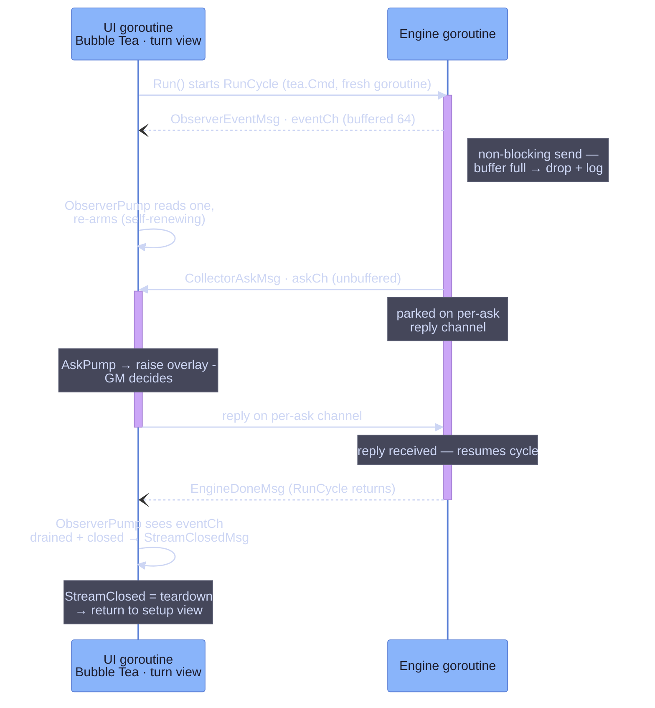

# Event Stream — The Engine⇄TUI Bridge

> **Code:** `internal/faction/tui/adapter/`, `internal/faction/tui/dryrun.go`

## Purpose

The adapter is the bridge between the headless [engine](../engine/overview.md) and
the Bubble Tea UI. The engine wants to *call* the GM — block until a decision
comes back — but a Bubble Tea program is a message loop that cannot be called
into. The adapter reconciles the two by running the engine on its own goroutine
and translating its synchronous collector/observer seams into two channels of
`tea.Msg`s: an **ask channel** that parks the engine while the GM decides, and an
**event channel** that streams notifications back. Every value that crosses the
bridge is a copy the UI owns outright — no view ever holds an engine pointer.

## Shape

### The goroutine and the two channels

`Adapter` holds the engine, the faction state, and the two channels:

```go
askCh   chan CollectorAskMsg      // unbuffered — a question blocks the engine
eventCh chan ObserverEventMsg     // buffered (64) — a notification never blocks
```

The asymmetry is the whole design. `Run()` returns a `tea.Cmd` that, on a fresh
goroutine, starts the turn if needed and calls `engine.RunCycle` with the
adapter's `Collectors` and `Observer`. From there:

- When the engine needs a decision, a **collector** method runs `adapter.ask`,
  which sends a `CollectorAskMsg` on the **unbuffered** `askCh` and blocks on a
  per-ask reply channel. The engine goroutine is now parked — it cannot proceed
  until the UI sends a reply. This is exactly the synchronous call the engine
  wanted, realized as a channel round-trip.
- When something happens worth showing, the **observer** emits an
  `ObserverEventMsg` on the **buffered** `eventCh` with a *non-blocking* send: if
  the buffer is full the event is dropped and logged (`"observer event dropped —
  eventCh full"`), never stalling the turn. A notification must not hold up the
  game; a decision must.

`Run` ends by returning `EngineDoneMsg{Err}` and, via `defer`, closing both
channels.



### The pumps and the re-arm loop

Bubble Tea commands are one-shot, so each channel is drained by a self-renewing
pump. `ObserverPump()` and `AskPump()` each return a `tea.Cmd` that reads *one*
value and returns it as a message; the consuming router re-issues the same pump
after every receipt to keep it alive. The router is the turn [view](views.md)
(`views/turn/turn.go`):

```go
case adapter.ObserverEventMsg:
    m.execution, _ = m.execution.Update(msg)
    return m, m.adapter.ObserverPump()      // re-issue to keep the pump alive
case adapter.CollectorAskMsg:
    m.execution, execCmd = m.execution.Update(msg)
    return m, tea.Batch(execCmd, m.adapter.AskPump())  // execCmd carries overlay.Init()
```

Because the pumps re-arm *only from this router's `Update`*, leaving the turn
view mid-cycle would stop draining the channels and wedge the engine on its
unbuffered `askCh` send. That is the reason the turn view reports `ModeLocked()`
while a cycle runs (see [state machine](state-machine.md)).

### Teardown: StreamClosed, not EngineDone

When `RunCycle` returns, the goroutine sends `EngineDoneMsg` — but `eventCh` may
still hold buffered events not yet pumped to the UI. So `EngineDoneMsg` is *not*
the teardown signal: the router stashes its error in `doneErr` and waits. The
observer pump, reading a drained-and-closed `eventCh`, returns `StreamClosedMsg`
— and *that* is the teardown trigger, guaranteed to arrive only after every
buffered event has rendered. On a clean `StreamClosedMsg` the router returns to
the setup view; on a stashed fatal error it stays put so the GM sees it. This
ordering is why a cycle's final completion events always paint before the view
resets.

### Append-only message vocabulary

The bridge speaks two enums, `AskKind` and `EventKind`, each carried in a
`Kind` + `Payload any` envelope and type-asserted by the consumer. Both are
**append-only — never reorder** (`channels.go`): the existing kinds are a wire
contract between the engine-facing collectors and the UI-facing overlays, and a
reorder would silently re-map them. New asks (the Effort 3 action surface added a
dozen) are appended to the end.

### Adapter-built display payloads

The collector methods do more than relay the engine's arguments — they **build
the display payload the UI will render**, and in doing so copy every value out of
engine ownership. `emitCycleStarted` walks the faction order into `[]RailEntry`
of `{ID, Name}` so *"the execution view never holds engine pointers"*; the buy/
seize/homeworld prompts attach adapter-built `WorldNames` maps; defender prompts
attach `ownerNames`. A few payloads are *derived* rather than copied:
`SelectRepairOrders` and `SelectExpandInfluenceOrder` pre-compute per-target caps
(`RepairTarget`, `ReinforceTarget`) by porting the engine's own validation math
adapter-side, deliberately so the engine's `action` package stays untouched. The
engine goroutine is parked on the ask while this runs, so reading shared state is
race-free.

### The smoke / dry-run harness

The same two seams back a headless smoke test. `dryrun.go`'s `RunDryRun` builds a
minimal zero-asset faction and runs one full `RunCycle` with `SmokePhaseCollector`
(picks the first available action, no-ops the rest), `SmokeActionCollector`
(returns the recoverable `ErrActionUnavailable` for any prompt that shouldn't be
reached), and `SmokeObserver` (logs every event to slog) — no TUI, no channels,
all structured log output. It exercises the engine⇄collector contract end to end
without a terminal, which is what makes the bridge's two halves independently
verifiable.

## Key Decisions

- **The engine runs on a goroutine behind two channels.** A Bubble Tea program
  can't be called into, but the engine is built to call out for decisions. Running
  it on its own goroutine and bridging with channels gives the engine its blocking
  collector calls and the UI its message loop, with neither aware of the other's
  shape. (Frozen log 77–83, extended 90–95.)
- **Asks block, events don't.** `askCh` is unbuffered so a collector call parks
  the engine until the GM replies; `eventCh` is buffered and sent to without
  blocking (dropping + logging on overflow) so a notification never stalls the
  turn. The buffering choice encodes which crossings are control flow and which
  are display.
- **One shared unbuffered ask channel.** `ask` is hoisted onto `*Adapter` so the
  phase collector and the action collector share a single `askCh`, keeping the
  engine's two input contracts behind one UI round-trip. (Discovery Decision 4.)
- **Teardown waits for `StreamClosedMsg`, not `EngineDoneMsg`.** `EngineDoneMsg`
  fires when the goroutine returns, but buffered events may still be unrendered.
  The pump emits `StreamClosedMsg` only after `eventCh` is drained and closed, so
  using it as the teardown signal guarantees the final events render before the
  view resets. (`channels.go` comment.)
- **The synthetic `EvtCycleStarted` is emitted single-threaded before
  `RunCycle`.** The rail of factions is seeded by hand on the `Run` goroutine
  before the engine starts firing events, when `CurrentTurn` is known-set and
  nothing else touches it — so it races nothing and the rail is populated before
  the first real event. (`run.go` comment.)
- **The message enums are append-only.** `AskKind`/`EventKind` are a positional
  wire contract; kinds are only appended, never reordered, so the `Payload any`
  type-assertions on the consuming side stay valid as the surface grows.
- **The adapter copies everything the views render.** Display payloads are built
  from copies and adapter-derived caps, never live engine or domain pointers, so
  the render goroutine and the engine goroutine never share mutable state. Where a
  payload needs engine validation logic, that logic is ported adapter-side rather
  than exported, keeping the engine `action` package UI-agnostic. (Decision 3.)

## Dependencies

**Depends on** the [orchestrator](../engine/orchestrator.md)'s two seams — it
implements `engine.PhaseCollector` and `action.Collector` (the input contracts)
and `engine.TurnObserver` (the output channel), and calls `engine.RunCycle`. It
reads the `engine.World` router and `rulebook` to derive display payloads, and
`domain`/`state`/`action`/`hooks` types for the payload structs.

**Depended on by** the turn [view](views.md), which owns the adapter lifecycle:
it constructs one per cycle, batches `Run`/`ObserverPump`/`AskPump`, routes
`ObserverEventMsg` and `CollectorAskMsg` into the execution sub-model (which
renders events and raises [overlays](overlays.md) for asks), and discards the
adapter on return to setup. The [state machine](state-machine.md)'s `modeLocker`
exists to protect this view's pumps while a cycle is live.
