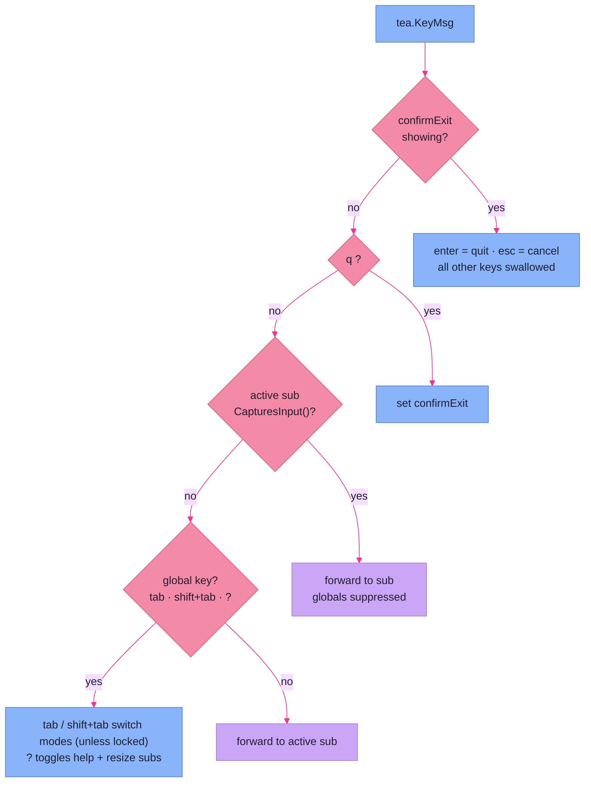

# Root Model & State Machine

> **Code:** `internal/faction/tui/{model,update,view}.go`, `internal/faction/tui/views/modebar/modebar.go`

## Purpose

This page covers the root of the Bubble Tea program: the `Model` that holds the
mode bar and the per-mode sub-models, and the `Update` loop that routes every
message to the right place under a deliberately narrow contract — the **Update
Discipline**. The root is a switchboard and a projection of state, never a player
of the game: it forwards user intent down to a sub-model and engine state up to
the view, and it is structurally forbidden from doing anything else.

## Shape

### The root model

```go
type Model struct {
	bar          modebar.Model
	subs         map[modebar.Mode]tea.Model
	help         help.Model
	factionState *state.FactionState
	campaignID   string
	width, height int
	confirmExit  bool
}
```

`NewModel` builds the mode bar and a `map[Mode]tea.Model` holding one sub-model
per *live* mode — `manage.New(...)` under `ModeManage`, `turn.New(...)` under
`ModeTurn`. The disabled `ModeSpatial` has no entry. Each sub-model is a full
`tea.Model` in its own right; the root never reaches inside one, it only forwards
messages and calls `View()`. `Init` returns `nil` — there is no startup command,
because nothing drives the engine until the GM enters Turn mode and the
[turn view](views.md) launches the [adapter](event-stream.md).

### The Update Discipline

`update.go` opens with the contract the whole root is built to honor, lifted from
`tui-rebuild-arc-discovery.md`:

> **MAY:** forward messages to the active sub-model; handle global keys (Tab,
> Shift-Tab, q, ?, Esc); update mode-bar state and switch modes; update the root
> overlays (help, confirm-exit); return `tea.Cmd`s for adapter I/O (engine
> launch, observer pump).
>
> **MAY NOT:** call engine methods directly; mutate `*state.FactionState` or any
> `*domain.*` value; perform I/O outside a `tea.Cmd`; embed game logic — turn
> ordering, action selection, mutation application all belong to the engine.
> *Update is a projection of engine state and a forwarder of user intent.*

Everything below is an application of that rule. The root touches no game state;
when a turn needs to run, the root returns the adapter's `tea.Cmd` and lets the
engine goroutine do the work (see [event stream](event-stream.md)).

### Message routing

`Update` switches on message type:

- **`tea.WindowSizeMsg`** — store the new terminal size and `resizeSubs()`, which
  recomputes the content budget and forwards it to every sub (see
  [regions](regions.md)).
- **`tea.KeyMsg`** — the routing core, in priority order:
  1. If `confirmExit` is showing, only `enter` (quit) and `esc` (cancel) are
     live; every other key is swallowed.
  2. `q` sets `confirmExit` — checked *before* anything else, so quit is reachable
     even while a sub-model is capturing input.
  3. If the active sub is an `inputCapturer` reporting `CapturesInput()`, every
     key is forwarded to it and the global bindings are suppressed.
  4. Otherwise the globals run: `tab`/`shift+tab` switch modes (unless locked),
     `?` toggles the help bar (and re-sizes subs, since help changes the budget).
- **anything else** — forwarded to the active sub-model.

`afterModeChange` is currently a pass-through (`return m, nil`); it exists as the
seam where a mode switch would arm or tear down per-mode work, kept explicit so
that logic has an obvious home if a future mode needs it.



### Capability predicates

The root discovers what the active sub-model can do by asserting small
single-method interfaces, never by switching on concrete type. There are two:

```go
type inputCapturer interface{ CapturesInput() bool }
type modeLocker  interface{ ModeLocked() bool }
```

- **`inputCapturer`** — the sub owns the full keyboard while active (a text-entry
  overlay, say). When it captures, the root forwards every key and suppresses the
  global bindings — except `q`, which is matched earlier, so quit always works.
- **`modeLocker`** — the sub forbids leaving its mode right now. `ModeLocked()`
  gates *only* Tab/Shift-Tab; `q` and `?` stay live. The turn view reports locked
  while a cycle is running, because its event/ask **pumps re-arm only from its own
  `Update`** — switching away would strand the engine goroutine with no one
  draining its channels (see [event stream](event-stream.md)).

A new sub-model opts into either behavior simply by implementing the method; the
root needs no change. This is the interface-over-type-switch convention made
concrete.

### The mode bar and the disabled slot

`modebar` is its own `tea.Model`-ish value (used by the root, not the Bubble Tea
runtime directly). It holds an ordered slice of `slot{mode, disabled}` and an
active index. `Next`/`Prev` walk the slots and **skip disabled ones, wrapping**;
`SetActive(mode)` jumps to a mode only if it exists and is enabled. The seeded
bar is `Manage`, `Turn`, and a disabled `Spatial`.

The disabled slot is handled in three places that never special-case it as game
logic: the mode bar renders it dimmed and skips it when cycling, the root
registers no sub-model for it, and `View` routes it to a placeholder panel
(`"Spatial — reserved (faction-utilities / edit surface)"`). It is a structural growth
point — the bar, the routing, and the budget already accommodate a third mode;
only a registered sub-model is missing.

## Key Decisions

- **Update is a projection and a forwarder, never an engine caller.** The MAY/
  MAY-NOT header is the load-bearing constraint: the root holds no game logic,
  mutates no domain state, and does I/O only by returning a `tea.Cmd`. All engine
  work happens on the adapter goroutine; the root just shuttles messages. This is
  what keeps the UI testable and the engine headless.
- **Capability predicates over type switches.** The root asserts `inputCapturer`
  and `modeLocker` rather than switching on the concrete sub-model type, so new
  sub-models declare their needs by satisfying an interface and the root never
  grows a `case` per mode. (Frozen log 274–284.)
- **`modeLocker` guards the pumps.** A running cycle's event and ask pumps
  re-arm only from the turn sub's `Update`. If the GM could Tab away mid-cycle,
  those pumps would stop draining and the engine goroutine would block forever.
  `ModeLocked()` exists solely to forbid that switch — it gates mode change, not
  ordinary keys. (Frozen log 285–294.)
- **`q` is unconditionally global.** Quit-confirm is matched before the input-
  capture branch, so the GM can always reach it even inside a form. The cost — a
  form can't bind `q` to its own purpose — is accepted deliberately.
- **The disabled mode is a registered absence.** Spatial stays in the mode-bar
  slice (rendered, skipped on cycle) with no sub-model and a placeholder view, so
  the third mode is a drop-in: register a sub and flip `disabled`. The state
  machine is already shaped for it.

## Dependencies

**Depends on** `bubbletea` (the `Model`/`Update`/`View` contract and message
types), the [regions & chrome](regions.md) budget (`resizeSubs`, `contentHeight`,
`footerView`), the `modebar` sub-package, and the two mode [views](views.md)
(`manage`, `turn`) it constructs and forwards to. It receives an `*engine.Engine`
at construction and forwards it to the turn view — never storing or calling it
(the Update Discipline) — and holds `*state.FactionState` for the views to project.

**Depended on by** nothing else in the TUI — the root is the top of the tree. The
[event stream](event-stream.md) adapter is reached indirectly: the turn view
returns the adapter's `tea.Cmd`s up through the root's normal forwarding, which is
why `modeLocker` must protect the in-flight cycle.
