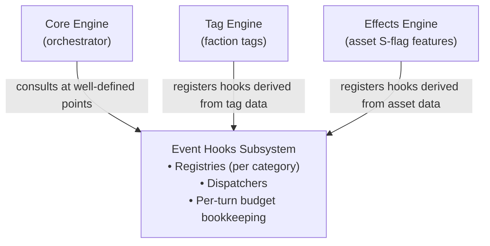

# Event Hooks Subsystem — Discovery

A design exploration of the Event Hooks subsystem: the framework through which tags, asset special features, and other reactive game mechanics integrate with the Core Engine.

<br/>

## Background

The Core Engine currently ships with a single-interface stub for `EventHook` (`internal/faction/engine/core_event_hook.go`) and a documented dispatch site in `RunFactionTurn` — but no registry, no dispatcher, and no consumers. Decisions #137 and #138 deferred the dispatcher under YAGNI: the Tag Engine wasn't ready and there was nothing to dispatch *to*.

That trade-off is now expiring. The TUI rebuild is the next major effort, and the rebuild will assume the Core Engine's collaboration surface is stable. Reactive mechanics — tags and `S`-flagged asset effects — are the largest unbuilt piece of that surface. If the framework lands after the TUI rebuild, the rebuild will have to be revisited every time a new hook category is added.

A close reading of the SWN faction rules (pp. 212–229) reveals that "reactive mechanics" is wider than the original `OnMutations` interface contemplated. Tag effects and `S`-flagged asset features fall into **five distinct shapes**, only one of which fits the existing stub. The goal of this effort is to ship a *complete foundation* — all five shapes defined, registration and dispatch in place, framework-level concerns (recursion, ordering, budgets) settled — without committing to full implementations of the Tag Engine or Effects Engine.

<br/>

## Goals & Non-Goals

**Goals**

- Define the full family of hook interfaces so all five reactive shapes have a clear home
- Land the registry, dispatcher, and per-turn budget machinery
- Implement enough hooks end-to-end to prove the seam works (litmus test below)
- Ensure no future hook addition forces changes to the Core Engine, the TUI, or any sub-engine outside the consumer that owns it

**Non-Goals**

- Full Tag Engine implementation (every tag handler)
- Full Effects Engine implementation (every `S`-flagged asset)
- LLM/AI-driven hook decisions
- Cross-faction hook coordination beyond what the rules already require

**Litmus test for completeness:** the Tag Engine and Effects Engine can be expanded with new tags and effects, in their own packages, without touching `internal/faction/engine/core_*.go` or `cmd/faction-manager/tui/`.

<br/>

## Anatomy



The Core Engine is the only caller of the Event Hooks subsystem. Tag Engine and Effects Engine are *consumers* in the sense that they translate their domain data (tag definitions, asset definitions) into registered hooks; they never call the dispatchers directly. This matches the existing pattern where `RegisterDefaultActions` populates the Action registry without the Core Engine knowing what individual actions exist.

<br/>

## The Five Hook Categories

Each category gets its own interface in the `eventhooks` package. Categories are independent: a tag or asset may register hooks in any combination of categories. The Core Engine consults each category's dispatcher at the appropriate point in the turn pipeline.

### 1. `RollModifier` — pre-roll dice augmentation

**Trigger:** before any d10 roll the engine is about to make (attack, defense, faction test, contested roll).
**Direction:** Engine ↔ hook (consults `InputCollector` for GM elections; affects roll outcome).
**Sample consumers (rules):**
- Warlike, Plutocratic, Machiavellian, Theocratic, Imperialists, Savage, Deep Rooted, Eugenics Cult, Exchange Consulate, Perimeter Agency (tags: +1d10 keep highest in matching context)
- Eugenics Cult Gengineered Slaves, Panopticon Matrix on its planet (asset roll bonuses)

**Signature sketch:**
```go
type RollModifier interface {
    OfferModifiers(ctx RollContext, factionState, rulebook) []ModifierOffer
}

type RollContext struct {
    Phase       RollPhase  // Attack, Defense, FactionTest, Contested
    Actor       *Faction
    Opponent    *Faction   // nil for solo rolls
    Attribute   FactionStat
    Asset       *Asset     // nil if non-asset roll
    World       string
}

type ModifierOffer struct {
    Source       string  // "tag:Warlike" / "asset:Book of Secrets:C7-001"
    Description  string  // "+1d10, keep highest"
    BudgetKey    string  // empty if unlimited; non-empty consults faction budget
    Apply        func(roll *RollState)
}
```

The engine assembles offers, presents elective ones to the GM via `InputCollector.SelectModifiers(offers)`, applies the chosen ones, and decrements the relevant faction budgets.

### 2. `RollResultHook` — post-roll inspection & rerolls

**Trigger:** after a roll has produced its dice but before the result is final.
**Direction:** Engine ↔ hook (may consult `InputCollector` for elective rerolls).
**Sample consumers:**
- Fanatical (auto-reroll 1s — non-elective)
- Psychic Academy (force rival reroll, once per turn)
- Book of Secrets (reroll one die per turn)

**Signature sketch:**
```go
type RollResultHook interface {
    OnRollResult(ctx RollContext, result RollResult, factionState, rulebook) RerollDirective
}

type RerollDirective struct {
    Source     string
    Indices    []int   // dice positions to reroll
    BudgetKey  string  // optional
    Elective   bool    // if true, GM is asked first
}
```

### 3. `MutationReactor` — post-event reactions

**Trigger:** after the engine has assembled a working list of mutations for an action, before applying them.
**Direction:** Engine ↔ hook (may emit additional mutations).
**Sample consumers:**
- Scavengers tag (+1 Coin on asset destruction, own or rival)
- Tripwire Cells, Lobbyists (immediate test on event)
- Boltholes, False Front (intercept destruction)
- Cracked Comms (turn defense into self-attack on attacker)
- Blockade Fleets (steal Coin on successful attack)

**Signature** — already shipped at `core_event_hook.go`:
```go
type MutationReactor interface {  // current name: EventHook
    OnMutations(mutations []domain.Mutation, factionState, rulebook) []domain.Mutation
}
```

The existing `EventHook` interface is renamed `MutationReactor` for clarity within the family. Behavior preserved. Recursion bounded at depth 5 per decision #138.

### 4. `RuleModifier` — query-time rule alterations

**Trigger:** when the Core Engine or a sub-engine asks the rulebook a *parameterised* question — "what does it cost to buy this asset?", "what's the effective tech level of this world?", "what extra abilities does this asset have?". Not a reactive event, but lives in the same subsystem because its consumers (tags, effects) are the same.

**Direction:** Engine → hook → modified answer. Synchronous, no GM input.

**Sample consumers:**
- Preceptor Archive (-1 Coin on TL4+ purchase)
- Pirates (rivals pay +1 Coin to move onto Pirate-BoI worlds)
- Colonists, Technical Expertise (TL upgrades on certain worlds)
- Capital Fleets (+2 Coin maintenance)
- Mercenary Group (every asset gains a 1-hex move ability)
- Secretive (assets begin Stealthed on purchase — modifies Buy Asset post-resolution)

**Signature sketch (typed family rather than one generic):**
```go
type AssetCostModifier interface {
    ModifyAssetCost(buyer *Faction, def *AssetDefinition, world string, baseCost int) int
}
type WorldTechLevelModifier interface {
    ModifyWorldTechLevel(faction *Faction, world string, baseTL int) int
}
type MaintenanceCostModifier interface {
    ModifyMaintenanceCost(owner *Faction, asset *Asset, baseCost int) int
}
type AssetMovementGranter interface {
    GrantedMovementAbilities(asset *Asset) []MovementAbility
}
// ... extended as new patterns appear
```

A generic `RuleModifier` interface was rejected as too loose: callers would pass typed questions through an `interface{}` payload and lose compile-time safety. The typed family is YAGNI-friendly — only add interfaces when the corresponding rule path needs to be extensible.

### 5. `TieResolver` — global rule overrides at tie points

**Trigger:** at well-defined decision points where a tag or effect changes a *default* rule outcome (not just modifies a value).

**Direction:** Engine → hook → enum verdict.

**Sample consumers:**
- Fanatical (always loses ties — overrides the default tie behavior; the rules state "they always lose ties during attacks")

This is the smallest category by volume, but the rule is rare enough that folding it into Cat 4 would dilute the typed-family approach. Separate interface keeps the override semantics explicit.

```go
type TieResolver interface {
    ResolveTie(ctx RollContext, factionState) TieOutcome // Standard | AttackerWins | DefenderWins
}
```

<br/>

## Category Summary

| # | Interface | When it fires | Affects state? | GM-elected? | Sample owner |
|---|-----------|---------------|----------------|-------------|--------------|
| 1 | `RollModifier` | Pre-roll | Roll only | Yes (if `BudgetKey` set) | Warlike tag |
| 2 | `RollResultHook` | Post-roll, pre-resolution | Roll only | Sometimes | Fanatical, Book of Secrets |
| 3 | `MutationReactor` | Post-action, pre-Apply | Yes (mutations) | No | Scavengers tag, Boltholes |
| 4 | `RuleModifier` (family) | On rule query | Indirectly (modifies inputs) | No | Preceptor, Pirates |
| 5 | `TieResolver` | Tie detection | Yes (resolution outcome) | No | Fanatical |

<br/>

## Once-Per-Turn Budgets

Many hooks have a once-per-turn limit (`Once per turn, this faction can roll an additional d10…`). Three intertwined questions:

| Question | Decision | Rationale |
|---|---|---|
| Where does "used this turn" state live? | On the faction (`Faction.HookBudgets map[string]int`) | Persists across pause/resume; saved with `FactionState` like every other turn-state field |
| Auto-fire or GM-elected? | GM-elected via `InputCollector` | Faithful to the rules' intent — GMs save bonuses for clutch rolls; auto-fire would silently spend the budget |
| Framework- or hook-enforced? | Framework-enforced | Hook descriptors declare `BudgetKey` and `MaxUsesPerTurn`; the dispatcher checks/decrements. Hook authors don't reinvent bookkeeping |

**Refill point.** Budgets reset at the start of each faction's own turn (during bookkeeping) — matches the rules' "once per turn" wording, where "turn" refers to that faction's turn within a cycle.

**Persistence.** `Faction.HookBudgets` is a new field on `Faction` in the domain layer, serialized in `faction_state.toml`. Empty for factions with no budgeted hooks; small additive change.

<br/>

## Registration & Dispatch

**Registration is consumer-owned.** Tag Engine and Effects Engine each call into `eventhooks.Registry.Register*` for the categories their data populates. Registration happens at engine startup (`engine.New`), the same lifecycle moment as `RegisterDefaultActions`.

**Per-faction scoping.** Hooks may be scoped to a faction (most tag hooks), to a specific asset (most `S`-flag hooks), or globally (rare). The registry keys hooks by scope so dispatch only consults relevant hooks; this avoids every hook having to filter `factionState` for itself.

**Ordering.** Within a category, dispatch is **registration order** (decision Q2 from orchestrator discovery, deferred until now). Stable across restarts because both the Tag Engine and Effects Engine register from sorted definition IDs. Alphabetical-by-source is a fallback if registration order ever proves non-deterministic.

**Recursion.** Only Cat 3 (`MutationReactor`) can recurse — a returned mutation can trigger another reactor. Bounded at depth 5 per decision #138; on cap trip the engine logs and stops. Other categories are non-recursive by construction (a `RollModifier` doesn't fire other roll modifiers; rolls happen once per call site).

**Dispatch sites in the Core Engine:**

| Category | Site |
|---|---|
| `RollModifier` | `domain.DiceRoll.Roll` (or a wrapper called by every roll site) |
| `RollResultHook` | Same site, after dice produced |
| `MutationReactor` | `core_orchestrator.go` `RunFactionTurn`, between mutation assembly and `MutationEngine.Apply` (currently documented stub) |
| `RuleModifier` (family) | At each rule path: `actions/buy_asset.go` cost calc, `bookkeeping.go` maintenance, etc. |
| `TieResolver` | `engine/action/actions/attack.go` resolve loop (and any other tie site) |

<br/>

## Tag Engine & Effects Engine

Both engines follow the same pattern:

1. Load definitions (tags from `tags.toml`, effects from existing asset data).
2. For each definition, instantiate one or more hook implementations (a tag may produce a `RollModifier` *and* a `MutationReactor`).
3. Register them with the appropriate `eventhooks.Registry` dispatcher, scoped to the owning faction or asset.
4. On state change (tag added, asset destroyed), update registrations.

**Tag Engine specifics:**
- Definitions are TOML-driven (`tags.toml` in the rulebook), per decision-log practice for static data
- Per-faction registration happens when a faction acquires a tag (creation, Seize Planet, Change Homeworld for Deep Rooted, etc.)
- Tag-state mutations (adding/removing tags) are first-class `domain.Mutation` types so history records them

**Effects Engine specifics:**
- Definitions live alongside `AssetDefinition` (existing data); `S`-flag is the marker
- Per-asset registration happens at asset purchase; deregistration on destruction or sell
- Behaviour is already partly handled in code for `A`-flag (active abilities via `AbilityEngine`); this engine handles `S`-flag (passive/reactive) only

<br/>

## TUI Impact

Minimal, by design.

- The `InputCollector` interface gains two methods to support GM-elected hooks: `SelectModifiers(offers []ModifierOffer) []ModifierOffer` and `ConfirmReroll(directive RerollDirective) bool`. The TUI implements both.
- Once-per-turn budget state is rendered alongside other faction state in the review/turn views (small UI affordance: a "Budgets" panel showing remaining uses).
- No changes to the Core Engine ↔ TUI message protocol beyond the new `InputCollector` methods.

The litmus test from Goals applies here: *adding* a new tag should not require changes to the TUI. Confirmed because TUI consumes `InputCollector` interfaces, not concrete tag types.

<br/>

## Implementation Scope (this branch)

The discovery → plan → execution boundary is preserved. This discovery commits to *what to build*, not *how/when*. The implementation plan will phase the work; rough shape:

**Must-ship for the foundation to be complete:**
- All five interfaces defined in `internal/faction/engine/eventhooks/` (or similar package path)
- Registry + dispatcher for each category
- `Faction.HookBudgets` field added; serialization wired
- `InputCollector` extended with the two new methods
- Dispatch sites added to the Core Engine (no behaviour change when no hooks are registered)
- One end-to-end hook per *applicable* category as proof of life:
  - Cat 1: Warlike tag (+1d10 Force attack, once/turn)
  - Cat 2: Fanatical tag (auto-reroll 1s) — non-elective; simplest reroll
  - Cat 3: Scavengers tag (+1 Coin on asset destruction) — pure reaction
  - Cat 4: Preceptor Archive (cost reduction) OR Pirates (movement surcharge) — pick one
  - Cat 5: Fanatical tag (lose ties) — already pulled in for Cat 2
- Tests covering each implemented hook end-to-end through the orchestrator

**Deferred to follow-up effort(s):**
- Remaining tag handlers (most of `tags.toml`)
- Effects Engine — `S`-flag asset hooks (Boltholes, Tripwire, etc.)
- Hook registration/deregistration on dynamic state changes (asset destroyed mid-turn) — first pass registers at engine start only

<br/>

## Open Questions

| # | Question | Notes |
|---|---|---|
| 1 | Are categories 1+2 actually one interface with pre/post timing methods, or two separate interfaces? | Two separate is cleaner; merging is a small refactor if pain emerges |
| 2 | Should `RuleModifier` live in `eventhooks` at all, given it's not event-driven? | Strong argument for putting it in a sibling `rulemods` package since the lifecycle is identical to hooks but the semantics differ |
| 3 | Hook registration lifecycle — registered once at engine start, or re-registered when state changes (tag added mid-game, asset destroyed)? | Foundation: register-once is enough. Dynamic state churn deferred — see scope |
| 4 | Persisted budget format — flat map keyed by `BudgetKey` string, or structured per-tag/per-asset? | Flat map is simplest; structured would couple state shape to consumer-internal organisation |
| 5 | For Cat 1 proof-of-life: Warlike (simplest) vs. Eugenics Cult (richer — asset-scoped)? | Warlike covers the budget path; Eugenics adds asset scoping. Plan session decides |
| 6 | Should `MutationReactor` retain its current `OnMutations` signature, or take a richer context (action name, actor, etc.)? | Current signature works for examples surveyed; richer context can be added without breaking callers if a need emerges |
