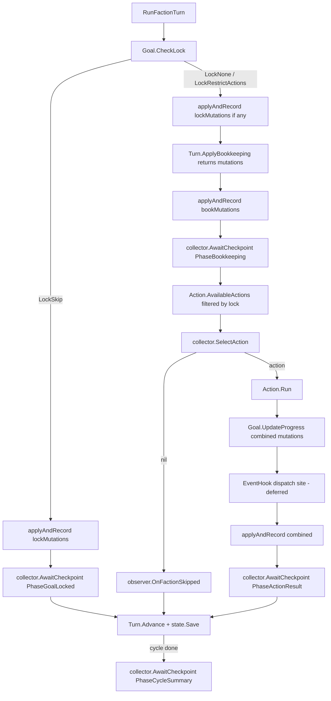

# Core Engine Orchestrator — Implementation Plan

A phased build guide for making the Core Engine the orchestrator of a faction turn. Three new collaboration interfaces (`InputCollector` extension, `TurnObserver`, `EventHook`) frame the engine's relationship with its callers. `EventHook` is documented as a seam in this refactor; its dispatcher is deferred until the Tag Engine lands.

This branch covers the **internal engine refactor only**. The TUI was deleted in Phase 1 to clear the way; a fresh TUI will be built against the new interfaces on a separate branch.

**Branch:** `feature/core-engine-orchestrator`

<br/>

## Context

Before Phase 1, the Core Engine composed six sub-engines but did not run them. The full per-faction pipeline — resume/skip prompts, goal lock evaluation, bookkeeping, action selection, action resolution, mutation application, history recording, state persistence — was driven by `TurnModel` in `cmd/faction-manager/tui/model.go`. Two consequences followed:

- The pipeline could not run without the Bubbletea event loop. Headless tests, AI batch runs, and any future non-TUI frontend were blocked.
- Adding a new action that needed mid-resolution prompts required touching the TUI state machine, the event channels, and the pending-message fields in `TurnModel`. The pattern was re-derived each time.

The intended outcome is for the Core Engine to be the orchestrator: it calls the sub-engines in sequence, asks the caller for decisions through `InputCollector`, narrates progress through `TurnObserver`, and (in a future PR) reacts to mutations through `EventHook`. A future TUI implements `InputCollector` + `TurnObserver` and reacts to engine-driven events rather than driving the engine.

Phase 1 cleared the runway by deleting the TUI and the `turn` Cobra command. Phase 2 (this session's work) lands the new interfaces and orchestrator. Phase 3 looks for restructure / cleanup opportunities across the engine package.

<br/>

## Shape of the Change

```
BEFORE                                  AFTER (Phase 2)
──────                                  ────────────────
TUI owns pipeline,                      caller (test harness today,
calls each sub-engine,                  fresh TUI tomorrow):
calls Apply / Record / Save                 │   constructs *config.Config
        │                                   │   constructs an InputCollector
        ▼                                   │   constructs a TurnObserver
┌──────┬──────┬──────┐                      ▼
▼      ▼      ▼      ▼              Engine.RunCycle ──► Engine.RunFactionTurn
Turn  Goal  Action  Mutation            │   drives pipeline,
                    History             │   owns Apply / Record / Save
                    state.Save          ▼
                                ┌── InputCollector (extended) ──► caller decisions
                                ├── TurnObserver                ──► caller display / logs
                                └── EventHook (interface only)  ──► future Tag Engine
```



<br/>

## Resolved Decisions

| #  | Decision | Rationale |
|----|----------|-----------|
| 1  | Acknowledgement gating lives on `InputCollector` as `AwaitCheckpoint(phase string) error` | Collector owns turn pacing; observers stay strictly fire-and-forget. Manual implementations block until GM continues; test/AI implementations return immediately. |
| 2  | Action selection lives on `InputCollector` as `SelectAction(faction, available) (Action, error)` | Engine computes `AvailableActions` itself; observer is not in the decision loop. |
| 3  | Multiple `EventHook` implementations fire in registration order | Simplest. Defer alphabetical-by-name decision until Tag Engine lands. |
| 4  | Hook recursion bounded at depth 5; on cap trip the engine logs and stops | Surface content bugs rather than silently absorb runaway loops. |
| 5  | `EventHook` ships as interface + documented dispatch site only — no registry, no `RegisterHook`, no dispatcher, no default no-op | The seam is needed now to lock the mutation-apply order; the dispatcher has no consumer until the Tag Engine ships. YAGNI. |
| 6  | Observer and collector are passed per-call to `RunFactionTurn` / `RunCycle`, not stored on `Engine` | Engine stays a long-lived stateless toolbox. The same engine instance can serve a manual run today and a headless test tomorrow without re-construction. |
| 7  | Runtime config (state path, history path) flows through a new `internal/faction/config` package holding a `Config` struct | Establishes the config pattern now while we're already moving things across the engine/CLI boundary; future runtime knobs (dry-run, log level, AI settings) join the same struct without churn. |
| 8  | `Turn.ApplyBookkeeping` is refactored to return mutations without applying them; the orchestrator owns apply + record | Removes the asymmetry where one sub-engine writes state and the others don't. Makes mutation flow uniform across the pipeline. |
| 9  | `ActionFactory` becomes `func(InputCollector) Action`; `AvailableActions` takes a collector and returns runnable actions | Without this, `SelectAction` returning `Action` is broken — current factories produce nil-collector stubs only good for `Validate`. The TUI's switch-on-Name reconstruction logic vanishes. Roller and AbilityEngine ride the factory closure (they're owned by Engine). |
| 10 | `Engine` gains a `Rand domain.Roller` field defaulting to `engine.NewRandRoller()`; tests can swap it | Action factories that need a roller (Attack, ExpandInfluence) capture `e.Rand` in the closure. Determinism in headless tests requires a single injection point. |
| 11 | Action registration moves to a `RegisterDefaultActions(*Engine)` helper in `internal/faction/engine/actions` | The previous registration site (`cmd/faction-manager/commands/turn.go`) was deleted in Phase 1. Putting the helper next to the action structs keeps engine and actions free of import cycles, and gives test harnesses + future TUI a single call to wire up the default action set. |

<br/>

## The Three Interfaces

### `InputCollector` (extended)

The existing 16 methods on `internal/faction/engine/input_collector.go` are unchanged. Two methods are added:

```go
type InputCollector interface {
    // ... existing 16 methods unchanged ...

    // SelectAction asks the caller to pick from the actions the engine has
    // already determined are valid for this faction. Returning a nil Action
    // signals "skip — take no action this turn".
    SelectAction(faction *domain.Faction, available []Action) (Action, error)

    // AwaitCheckpoint blocks until the caller signals readiness to proceed
    // past the named pipeline phase. Manual implementations gate on user
    // input (press to continue); test and AI implementations return nil
    // immediately. The phase name is one of the Phase* constants below.
    AwaitCheckpoint(phase string) error
}

const (
    PhaseBookkeeping  = "bookkeeping"
    PhaseActionResult = "action_result"
    PhaseGoalLocked   = "goal_locked"
    PhaseCycleSummary = "cycle_summary"
)
```

### `TurnObserver` (new)

The engine's output channel. Fire-and-forget — methods return nothing, the engine does not wait, observers cannot affect game state.

```go
type TurnObserver interface {
    OnFactionTurnStarted(faction *domain.Faction)
    OnFactionSkipped(faction *domain.Faction)
    OnGoalLockApplied(faction *domain.Faction, lock GoalLock, mutations []domain.Mutation)
    OnBookkeepingApplied(faction *domain.Faction, result BookkeepingResult, mutations []domain.Mutation)
    OnActionSelected(faction *domain.Faction, action Action)
    OnActionResolved(faction *domain.Faction, action Action, mutations []domain.Mutation)
    OnFactionTurnCompleted(faction *domain.Faction)
    OnCycleCompleted(cycleNumber int, factionState *state.FactionState)
    OnError(faction *domain.Faction, err error)
}
```

### `EventHook` (new — interface only, no dispatcher)

Documented now so the mutation-apply order is settled. Dispatch loop, registry, and `RegisterHook` are deferred.

```go
// EventHook reacts to mutations the engine is about to apply and may return
// additional mutations to apply alongside them. The natural consumer is the
// Tag Engine. The dispatcher is intentionally not implemented in this refactor —
// see the dispatch site comment in orchestrator.go (RunFactionTurn).
type EventHook interface {
    OnMutations(
        mutations []domain.Mutation,
        factionState *state.FactionState,
        rulebook *loader.Rulebook,
    ) []domain.Mutation
}
```

<br/>

## Engine Orchestrator API

Two new methods on `*Engine`. Both take collector and observer per-call (decision #6) and a `*config.Config` for path injection (decision #7).

```go
// RunFactionTurn drives one faction's turn from goal-lock check through
// state save. Errors are surfaced via observer.OnError and returned;
// partial mutations already applied stay applied.
func (e *Engine) RunFactionTurn(
    factionState *state.FactionState,
    cfg *config.Config,
    collector InputCollector,
    observer TurnObserver,
) (cycleComplete bool, err error)

// RunCycle calls RunFactionTurn until cycleComplete is true. The caller is
// responsible for calling Turn.Start (or resuming) before invoking — that
// decision is policy, not engine business.
func (e *Engine) RunCycle(
    factionState *state.FactionState,
    cfg *config.Config,
    collector InputCollector,
    observer TurnObserver,
) error
```

The resume / abandon / start-new prompt is the caller's responsibility. By the time `RunCycle` is called the caller has already committed; `RunCycle` resumes from the cursor if `Turn.InProgress` is true.

<br/>

## The `config` Package

```go
// internal/faction/config/config.go
package config

type Config struct {
    StatePath   string
    HistoryPath string
}
```

Scope note on `paths/`: the existing `cmd/faction-manager/paths` package is also consumed by `cmd/faction-manager/commands/narrate/cmd.go` (uses `p.Narratives`) and `cmd/faction-manager/commands/faction/{cmd.go,delete.go}` (uses `p.State`). Those non-engine commands' needs (a `Narratives` directory, plus state path) don't belong in `config.Config`. **Keep `paths/` as the CLI's path-derivation helper for now.** Future callers building a `*config.Config` derive it from `paths.New(campaignID).State` and `.History`.

<br/>

## ActionFactory and Roller (Decision #9, #10, #11)

`ActionFactory` changes from `func() Action` to `func(InputCollector) Action`. `Engine` gains a `Rand domain.Roller` field initialized to `engine.NewRandRoller()` in `New(...)`. Action factories that need a roller capture `e.Rand` in the closure; same for `e.AbilityEngine`.

`AvailableActions(faction, factionState, rulebook, collector)` calls each factory with the collector and runs `Validate`. Returned actions are runnable as-is — no second construction step in the orchestrator.

Registration lives in a single helper inside the actions package:

```go
// internal/faction/engine/actions/register.go
package actions

func RegisterDefaultActions(e *engine.Engine) {
    e.Action.Register(func(c engine.InputCollector) engine.Action { return NewSellAsset(c) })
    e.Action.Register(func(c engine.InputCollector) engine.Action { return NewRepairFaction() })
    e.Action.Register(func(c engine.InputCollector) engine.Action { return NewRepairAsset(c) })
    e.Action.Register(func(c engine.InputCollector) engine.Action { return NewBuyAsset(c) })
    e.Action.Register(func(c engine.InputCollector) engine.Action { return NewRefitAsset(c) })
    e.Action.Register(func(c engine.InputCollector) engine.Action { return NewAttack(c, e.Rand) })
    e.Action.Register(func(c engine.InputCollector) engine.Action { return NewExpandInfluence(c, e.Rand) })
    e.Action.Register(func(c engine.InputCollector) engine.Action { return NewBribe(c) })
    e.Action.Register(func(c engine.InputCollector) engine.Action { return NewUseAssetAbility(c, e.Rand, e.AbilityEngine) })
    e.Action.Register(func(c engine.InputCollector) engine.Action { return NewAbandonGoal() })
    e.Action.Register(func(c engine.InputCollector) engine.Action { return NewSeizePlanet(c) })
}
```

Callers (test harness today, future TUI tomorrow) do:

```go
e, _ := engine.New(dataDir)
actions.RegisterDefaultActions(e)
e.RunCycle(...)
```

The actions package already imports the engine package (for `InputCollector` etc.), so this helper introduces no new cycle.

<br/>

## Pipeline Sequence

`RunFactionTurn` executes the steps below, in order, for the current faction.

```
RunFactionTurn:

  faction := Turn.CurrentFaction(factionState)
  observer.OnFactionTurnStarted(faction)

  lock, lockMutations := Goal.CheckLock(faction, factionState, rulebook)
  observer.OnGoalLockApplied(faction, lock, lockMutations)

  if lock.Type == LockSkip:
      applyAndRecord(lockMutations, faction, "Change Homeworld (transit)")
      collector.AwaitCheckpoint(PhaseGoalLocked)
      return advance()

  if len(lockMutations) > 0:
      applyAndRecord(lockMutations, faction, "goal_lock")

  bookResult, bookMutations := Turn.ApplyBookkeeping(factionState)
  applyAndRecord(bookMutations, faction, "bookkeeping")
  observer.OnBookkeepingApplied(faction, bookResult, bookMutations)
  collector.AwaitCheckpoint(PhaseBookkeeping)

  available := Action.AvailableActions(faction, factionState, rulebook, collector)
  if lock.Type == LockRestrictActions:
      available = filterAllowedActions(available, lock.AllowedActions)

  action := collector.SelectAction(faction, available)
  if action == nil:
      observer.OnFactionSkipped(faction)
      return finishTurn(faction)

  observer.OnActionSelected(faction, action)

  actionMutations := Action.Run(action, faction, factionState, rulebook)
  goalMutations := Goal.UpdateProgress(faction.ID, actionMutations, factionState, rulebook)
  combined := append(actionMutations, goalMutations...)

  // === EventHook dispatch site (deferred per decision #5) ===
  // When Tag Engine lands: iterate registered hooks, append returned mutations,
  // recurse with depth bound 5.

  applyAndRecord(combined, faction, action.Name())
  observer.OnActionResolved(faction, action, combined)
  collector.AwaitCheckpoint(PhaseActionResult)

  return finishTurn(faction)

finishTurn:
  observer.OnFactionTurnCompleted(faction)
  cycleDone := Turn.Advance(factionState)
  state.Save(cfg.StatePath, factionState)
  if cycleDone:
      observer.OnCycleCompleted(factionState.CycleNumber, factionState)
      collector.AwaitCheckpoint(PhaseCycleSummary)
  return cycleDone
```

`applyAndRecord` is an internal helper (not exported) that wraps `Mutation.Apply` + `buildEventRecord` + `History.Record(cfg.HistoryPath, ...)` + `state.Save(cfg.StatePath, ...)`.

### Canonical mutation apply order

For any single action turn:

1. Action mutations (from `Action.Run`)
2. Goal progress mutations (from `Goal.UpdateProgress`, which inspects #1)
3. **`EventHook.OnMutations` site** — dispatcher inserts here when Tag Engine lands
4. `Mutation.Apply` on the combined list
5. `History.Record` on the same combined list
6. `state.Save`

Goal-lock and bookkeeping mutations each get their own `applyAndRecord` cycle (apply → record → save) before action selection, so they appear as distinct history events with `cause = "goal_lock"` and `cause = "bookkeeping"`.

<br/>

## Bookkeeping Signature Change (Decision #8)

Current (`internal/faction/engine/turn_engine.go`): `ApplyBookkeeping` builds mutations, calls `t.mutation.Apply(...)` internally, advances `Phase` to `PhaseAction`, returns `BookkeepingResult` (with `RecordedMutations` populated).

New: returns `(BookkeepingResult, []domain.Mutation, error)`. Does not call `Apply`. The orchestrator owns apply/record. The `RecordedMutations` field on `BookkeepingResult` is dropped (callers use the returned slice).

The narrative digest (`internal/faction/narrative/digest`) reads from history.jsonl, not from `RecordedMutations` — so removing the field is safe.

<br/>

## Headless Test Harness

```go
// internal/faction/engine/testharness/observer.go
type RecordingObserver struct {
    Events []ObservedEvent
}

type ObservedEvent struct {
    Kind    string // "TurnStarted", "ActionResolved", etc.
    Faction *domain.Faction
    Payload any
}
// ... one method per TurnObserver method ...
```

```go
// internal/faction/engine/testharness/collector.go
type ScriptedCollector struct {
    SelectAttackersFn func([]*domain.Asset, *loader.Rulebook) ([]*domain.Asset, error)
    SelectActionFn    func(*domain.Faction, []engine.Action) (engine.Action, error)
    // ... one optional fn per InputCollector method ...
}

func (c *ScriptedCollector) AwaitCheckpoint(_ string) error { return nil }
// SelectAction default: pick first available; returns nil only when slice empty.
// Other methods: call Fn if set, else return zero value.
```

Sample integration test (lives in `internal/faction/engine/orchestrator_test.go`):

```go
func TestRunCycle_TwoFactionsBuyAndAttack(t *testing.T) {
    eng, factionState, cfg := loadFixture(t, "two-factions-ready-to-attack")
    actions.RegisterDefaultActions(eng)

    collector := &ScriptedCollector{
        SelectActionFn: func(f *domain.Faction, available []engine.Action) (engine.Action, error) {
            return findActionByName(available, "Attack"), nil
        },
        SelectAttackersFn: func(eligible []*domain.Asset, _ *loader.Rulebook) ([]*domain.Asset, error) {
            return eligible[:1], nil
        },
        // ... defender, redirect ...
    }
    observer := &RecordingObserver{}

    if err := eng.Turn.Start(factionState); err != nil {
        t.Fatal(err)
    }
    if err := eng.RunCycle(factionState, cfg, collector, observer); err != nil {
        t.Fatal(err)
    }

    assertEventSequence(t, observer.Events,
        "TurnStarted", "BookkeepingApplied", "ActionSelected", "ActionResolved", "TurnCompleted",
        "TurnStarted", "BookkeepingApplied", "ActionSelected", "ActionResolved", "TurnCompleted",
        "CycleCompleted",
    )
    assertHistoryFileContents(t, cfg.HistoryPath, ...) // load-bearing — reads file from disk
}
```

Tests inject deterministic rolls via `eng.Rand = &fakeRoller{...}` before calling `RunCycle`.

The three Phase 2 integration tests must each assert **observer event sequence AND history file contents** (not just "no error returned"). They are the load-bearing demonstration that orchestration left the TUI; shallow tests defeat the purpose.

<br/>

## Phased Delivery

Three phases. Each is independently shippable and reviewable.

### Phase 1 — Delete the TUI and `turn` Cobra command (DONE)

**Status:** shipped in commit `aded14c` on `feature/core-engine-orchestrator`.

The TUI (`cmd/faction-manager/tui/`) and the `turn` Cobra command (`cmd/faction-manager/commands/turn.go`, `cmd/faction-manager/commands/turn/cmd.go`) were removed in full to clear the way for the orchestrator refactor. `buildEventRecord` was moved out of the TUI to `internal/faction/engine/event_record.go` so it survives. `cmd/faction-manager/paths/` and the `narrate` / `faction` Cobra commands were preserved.

The fresh TUI is out of scope for this branch — it will be built against the new interfaces on a separate branch in a separate effort.

---

### Phase 2 — Interfaces, config, factory change, engine orchestrator

**Goal:** Three interfaces defined. `config.Config` lives in `internal/faction/config`. `ActionFactory` takes a collector. `Engine.Rand` field added. `Turn.ApplyBookkeeping` refactored to return mutations without applying them. `RunFactionTurn` and `RunCycle` land on `Engine`. `RegisterDefaultActions` helper exists in the actions package. Headless test harness (`RecordingObserver`, `ScriptedCollector`) lives in `internal/faction/engine/testharness/`. Three load-bearing integration tests pass: two-faction full cycle, `LockSkip`, `LockRestrictActions`.

**Files to create**

- `internal/faction/config/config.go` — `Config` struct.
- `internal/faction/engine/observer.go` — `TurnObserver` interface, `Phase*` constants.
- `internal/faction/engine/event_hook.go` — `EventHook` interface only, with the deferred-dispatcher comment.
- `internal/faction/engine/orchestrator.go` — `RunFactionTurn`, `RunCycle`, internal `applyAndRecord`, `filterAllowedActions`.
- `internal/faction/engine/actions/register.go` — `RegisterDefaultActions(*engine.Engine)` helper.
- `internal/faction/engine/testharness/observer.go` — `RecordingObserver`.
- `internal/faction/engine/testharness/collector.go` — `ScriptedCollector`.
- `internal/faction/engine/orchestrator_test.go` — three load-bearing tests:
  1. Two factions, both pick an action, full cycle completes. Assert observer event sequence and history file contents.
  2. One faction with `LockSkip` (Change Homeworld countdown), one normal turn. Assert `OnGoalLockApplied` fires, bookkeeping is skipped on the locked faction, history records the lock event with `cause = "change_homeworld_transit"`.
  3. One faction with `LockRestrictActions` (Planetary Seizure combat phase). Assert `SelectAction` is called with only the Attack action, history records the resulting mutation event.

**Files to modify**

- `internal/faction/engine/input_collector.go` — append `SelectAction` and `AwaitCheckpoint`; declare the `Phase*` constants (or co-locate in `observer.go` — implementor's choice).
- `internal/faction/engine/core.go` — add `Rand domain.Roller` field; initialize in `New(...)` to `engine.NewRandRoller()`.
- `internal/faction/engine/action_engine.go` — change `ActionFactory` to `func(InputCollector) Action`; change `AvailableActions` to take a collector; iterate factories with the collector.
- `internal/faction/engine/turn_engine.go` — change `ApplyBookkeeping` signature to `(BookkeepingResult, []domain.Mutation, error)`; remove the internal `Mutation.Apply` call; drop `RecordedMutations` field from `BookkeepingResult`.
- Existing tests in `internal/faction/engine/turn_test.go` — update for the new `ApplyBookkeeping` signature.

**Verification**

```bash
go build ./...
go test ./internal/faction/engine/...
go test ./...
```

The three integration tests passing against a real `engine.Engine` with no Bubbletea program is the load-bearing demonstration that orchestration has truly left the TUI.

**Commit:** `feat: phase 2 — engine orchestrator, three interfaces, config package, headless test harness`

---

### Phase 3 — Engine package restructure / cleanup

**Goal:** Take a deliberate pass at the engine package's shape now that orchestration has landed. Candidates accumulate in [Refactor Candidates](#refactor-candidates) below as Phase 2 implementation surfaces them. At Phase 3 entry, Robert reviews the list, prioritizes, and we land changes in small reviewable commits.

**Likely scope (placeholder until Phase 2 fills the candidate list):**

- File / package layout — should `orchestrator.go` move to its own subpackage? Should sub-engines (`turn`, `action`, `goal`, `mutation`, `history`) be subpackages?
- Sub-engine API consistency — uniform constructor naming (`new*Engine` vs `New*Engine` is currently mixed), uniform method signatures, uniform error handling.
- Naming clean-up — orchestrator-era names that read awkwardly now that the pipeline is engine-driven.
- Test seam tightening — fixtures, fakes, and the test harness's API.

**Verification**

```bash
go test ./...
go vet ./...
```

**Commit pattern:** small commits per cleanup, each titled `refactor: <area> — <change>`.

<br/>

## Refactor Candidates

Running list of restructure / cleanup opportunities surfaced during Phase 2 implementation. Each entry: **what**, **why**, **rough size**. Phase 3 pulls from here.

- **Drop the `*MutationEngine` arg from `newTurnEngine`.** The TurnEngine no longer applies mutations, so the constructor parameter is unused — Phase 2 left it as `_ *MutationEngine` to avoid touching the `core.go` call site. Drop the param and update `Engine.New`. *Tiny.*
- **Unify sub-engine constructor visibility.** `newTurnEngine`, `newMutationEngine`, `newActionEngine`, `newHistoryEngine` are unexported; `NewAbilityEngine`, `NewGoalEngine`, `NewRandRoller` are exported. Only `Engine.New` calls them — make all unexported (or all exported and stop initializing in `New`). *Small.*
- **Disambiguate "Phase".** `engine.PhaseBookkeeping` (checkpoint name on InputCollector) and `domain.PhaseBookkeeping` (turn-cursor state) are now adjacent and easy to confuse. Rename the checkpoint constants to `CheckpointBookkeeping` etc., or move them onto a `Checkpoint` type. *Small, mechanical.*
- **Inline `event_record.go`.** A 25-line file housing one helper used only by `orchestrator.go`. Either inline `buildEventRecord` into `applyAndRecord`, or merge the file into `orchestrator.go`. *Tiny.*
- **Add `engine.NewWithRulebook(*loader.Rulebook)`.** Phase 2 tests had to point at `../data` to construct an Engine because `engine.New` does disk I/O. A rulebook-injecting constructor would make engine-package unit tests independent of fixture files and unlock truly hermetic tests in higher-level packages. *Small.*
- **Trim `BookkeepingResult`.** `IncomeGained = WealthIncome + StatIncome` — the sum is computed eagerly even though callers could derive it. Now that `RecordedMutations` is gone, the struct's other redundancies stand out. *Tiny.*
- **`AssetRef` in `turn_engine.go` may be redundant.** Same data lives in `AssetRemoved` / `AssetMaintainedFlag` mutations. If display callers can derive from mutations, the helper struct + the `AssetsLost` / `AssetsUnmaintained` fields can collapse. *Investigate first; small if it pans out.*
- **Sub-package layout — sub-engines as their own packages?** `engine.go` currently composes six sub-engines as fields on a struct in one package. With the orchestrator landing, the package's purpose is split between "the orchestrator" and "the sub-engines." Worth an architectural discussion before any move. *Larger; design first.*

<br/>

## Out of Scope

- Tag Engine and any tag-based reactive mechanic.
- AI agent `InputCollector` implementation.
- The `EventHook` dispatcher itself — registry, `RegisterHook`, dispatch loop, depth-5 recursion counter, error logging on cap trip. The interface and the documented dispatch site are the entire `EventHook` deliverable.
- Alphabetical-by-name hook ordering. Registration order ships first.
- Any change to `domain.Mutation` types or `MutationEngine.Apply` signature.
- Migrating `narrate` and `faction` commands to `config.Config`. They keep using `paths/`. Possible follow-up.
- Backward-compat shims, feature flags, or parallel pipeline modes. The cutover is clean per phase.
- **TUI rebuild.** Will be built against the new interfaces on a separate branch in a separate effort. Not this branch.

<br/>

## Verification

### Build

```bash
go build ./...
```

### Unit and integration tests

```bash
go test ./...                              # full suite — must pass after every phase
go test ./internal/faction/engine/...      # focused engine + orchestrator tests
go test -run TestRunCycle ./...            # headless cycle tests
```

### Key proof point

The three Phase 2 integration tests (two-faction full cycle, `LockSkip`, `LockRestrictActions`) running green against a real `engine.Engine` with no Bubbletea program — and each asserting both observer event sequence AND history file contents — is the load-bearing demonstration that orchestration has truly left the TUI.

<br/>

## Critical Files for Implementation

- `internal/faction/engine/core.go` — engine struct; gains `Rand` field; where `RunFactionTurn` and `RunCycle` are called from.
- `internal/faction/engine/action_engine.go` — `ActionFactory` signature change; `AvailableActions` takes collector.
- `internal/faction/engine/input_collector.go` — extended with `SelectAction` and `AwaitCheckpoint`.
- `internal/faction/engine/turn_engine.go` — `ApplyBookkeeping` signature changes (returns mutations instead of applying them).
- `internal/faction/engine/goal_engine.go` — `CheckLock` and `UpdateProgress` are called by orchestrator (no change to signatures).
- `internal/faction/engine/event_record.go` — already moved out of the TUI in Phase 1; consumed by `applyAndRecord`.
- New: `internal/faction/engine/orchestrator.go`, `observer.go`, `event_hook.go`.
- New: `internal/faction/engine/actions/register.go`.
- New: `internal/faction/config/config.go`.
- New: `internal/faction/engine/testharness/{observer,collector}.go`.
- New: `internal/faction/engine/orchestrator_test.go`.
