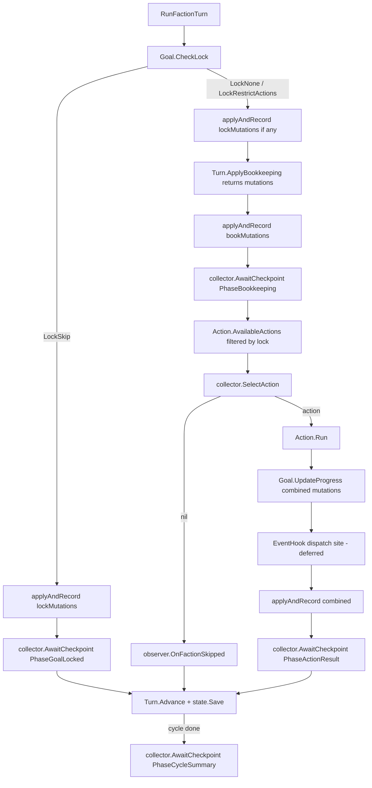

# Core Engine Orchestrator — Implementation Plan

A phased build guide for moving turn orchestration from the TUI into the Core Engine. Three new collaboration interfaces (`InputCollector` extension, `TurnObserver`, `EventHook`) frame the engine's relationship with its callers. `EventHook` is documented as a seam in this refactor; its dispatcher is deferred until the Tag Engine lands.

The deliverable of this planning session is this implementation doc itself, intended to live at `docs/implementation/core-engine-orchestrator.md` once approved.

**Branch:** `feature/core-engine-orchestrator`

<br/>

## Context

The Core Engine (`internal/faction/engine/core.go:9-33`) currently composes six sub-engines but does not run them. The full per-faction pipeline — resume/skip prompts, goal lock evaluation, bookkeeping, action selection, action resolution, mutation application, history recording, state persistence — is driven by `TurnModel` in `cmd/faction-manager/tui/model.go`. Two consequences follow:

- The pipeline cannot run without the Bubbletea event loop. Headless tests, AI batch runs, and any future non-TUI frontend are blocked.
- Adding a new action that needs mid-resolution prompts requires touching the TUI state machine, the event channels, and the pending-message fields in `TurnModel`. The pattern is re-derived each time.

The intended outcome is for the Core Engine to be the orchestrator: it calls the sub-engines in sequence, asks the caller for decisions through `InputCollector`, narrates progress through `TurnObserver`, and (in a future PR) reacts to mutations through `EventHook`. The TUI becomes a display layer that implements two interfaces and reacts to engine-driven events rather than driving the engine.

<br/>

## Shape of the Change

```
BEFORE                                          AFTER
──────                                          ─────
Cobra cmd (turn)                                Cobra cmd (turn)
    │                                               │   constructs *config.Config
    └─► TUI.RunTurnTUI ──┐                          │   constructs TUICollector, TUIObserver
                         │ owns pipeline,           ▼
                         │ calls each sub-engine,   TUI.RunTurnTUI
                         │ Apply / Record / Save        │   spawns goroutine that calls:
                         ▼                              ▼
        ┌────────┬────────┬────────┐        Engine.RunCycle ──► Engine.RunFactionTurn
        ▼        ▼        ▼        ▼            │  drives pipeline
      Turn    Goal    Action    Mutation        │  Apply / Record / Save lives here
                                  History       ▼
                                  state.Save     ┌──── InputCollector (extended) ──► TUI sub-models
                                                 ├──── TurnObserver  ──► TUI snapshot/log
                                                 └──── EventHook     ──► (interface only; no dispatch)
```



<br/>

## Resolved Decisions

| # | Decision | Rationale |
|---|----------|-----------|
| 1 | Acknowledgement gating lives on `InputCollector` as `AwaitCheckpoint(phase string) error` | Collector owns turn pacing; observers stay strictly fire-and-forget. Manual TUI blocks until GM continues; test/AI implementations return immediately. |
| 2 | Action selection lives on `InputCollector` as `SelectAction(faction, available) (Action, error)` | Engine computes `AvailableActions` itself; observer is not in the decision loop. |
| 3 | Multiple `EventHook` implementations fire in registration order | Simplest. Defer alphabetical-by-name decision until Tag Engine lands. |
| 4 | Hook recursion bounded at depth 5; on cap trip the engine logs and stops | Surface content bugs rather than silently absorb runaway loops. |
| 5 | `EventHook` ships as interface + documented dispatch site only — no registry, no `RegisterHook`, no dispatcher, no default no-op | The seam is needed now to lock the mutation-apply order; the dispatcher has no consumer until the Tag Engine ships. YAGNI. |
| 6 | Observer and collector are passed per-call to `RunFactionTurn` / `RunCycle`, not stored on `Engine` | Engine stays a long-lived stateless toolbox. The same engine instance can serve a manual TUI run today and a headless test tomorrow without re-construction. |
| 7 | Runtime config (state path, history path) flows through a new `internal/faction/config` package holding a `Config` struct | Establishes the config pattern now while we're already moving things across the engine/CLI boundary; future runtime knobs (dry-run, log level, AI settings) join the same struct without churn. |
| 8 | `Turn.ApplyBookkeeping` is refactored to return mutations without applying them; the orchestrator owns apply + record | Removes the asymmetry where one sub-engine writes state and the others don't. Makes mutation flow uniform across the pipeline. |
| 9 | `ActionFactory` becomes `func(InputCollector) Action`; `AvailableActions` takes a collector and returns runnable actions | Without this, `SelectAction` returning `Action` is broken — current factories produce nil-collector stubs only good for `Validate`. The TUI's switch-on-Name reconstruction logic vanishes. Roller and AbilityEngine ride the factory closure (they're owned by Engine). |
| 10 | `Engine` gains a `Rand domain.Roller` field defaulting to `engine.NewRandRoller()`; tests can swap it | Action factories that need a roller (Attack, ExpandInfluence) capture `e.Rand` in the closure. Determinism in headless tests requires a single injection point. |

<br/>

## The Three Interfaces

### `InputCollector` (extended)

The existing 16 methods on `internal/faction/engine/input_collector.go:12-34` are unchanged. Two methods are added:

```go
type InputCollector interface {
    // ... existing 16 methods unchanged ...

    // SelectAction asks the caller to pick from the actions the engine has
    // already determined are valid for this faction. Returning a nil Action
    // signals "skip — take no action this turn".
    SelectAction(faction *domain.Faction, available []Action) (Action, error)

    // AwaitCheckpoint blocks until the caller signals readiness to proceed
    // past the named pipeline phase. Manual implementations gate on user
    // input (press to continue); test and AI implementations return nil
    // immediately. The phase name is one of the Phase* constants below.
    AwaitCheckpoint(phase string) error
}

const (
    PhaseBookkeeping  = "bookkeeping"
    PhaseActionResult = "action_result"
    PhaseGoalLocked   = "goal_locked"
    PhaseCycleSummary = "cycle_summary"
)
```

### `TurnObserver` (new)

The engine's output channel. Fire-and-forget — methods return nothing, the engine does not wait, observers cannot affect game state.

```go
type TurnObserver interface {
    OnFactionTurnStarted(faction *domain.Faction)
    OnFactionSkipped(faction *domain.Faction)
    OnGoalLockApplied(faction *domain.Faction, lock GoalLock, mutations []domain.Mutation)
    OnBookkeepingApplied(faction *domain.Faction, result BookkeepingResult, mutations []domain.Mutation)
    OnActionSelected(faction *domain.Faction, action Action)
    OnActionResolved(faction *domain.Faction, action Action, mutations []domain.Mutation)
    OnFactionTurnCompleted(faction *domain.Faction)
    OnCycleCompleted(cycleNumber int, factionState *state.FactionState)
    OnError(faction *domain.Faction, err error)
}
```

### `EventHook` (new — interface only, no dispatcher)

Documented now so the mutation-apply order is settled. Dispatch loop, registry, and `RegisterHook` are deferred.

```go
// EventHook reacts to mutations the engine is about to apply and may return
// additional mutations to apply alongside them. The natural consumer is the
// Tag Engine. The dispatcher is intentionally not implemented in this refactor —
// see the dispatch site comment in orchestrator.go (RunFactionTurn).
type EventHook interface {
    OnMutations(
        mutations []domain.Mutation,
        factionState *state.FactionState,
        rulebook *loader.Rulebook,
    ) []domain.Mutation
}
```

<br/>

## Engine Orchestrator API

Two new methods on `*Engine`. Both take collector and observer per-call (decision #6) and a `*config.Config` for path injection (decision #7).

```go
// RunFactionTurn drives one faction's turn from goal-lock check through
// state save. Errors are surfaced via observer.OnError and returned;
// partial mutations already applied stay applied.
func (e *Engine) RunFactionTurn(
    factionState *state.FactionState,
    cfg *config.Config,
    collector InputCollector,
    observer TurnObserver,
) (cycleComplete bool, err error)

// RunCycle calls RunFactionTurn until cycleComplete is true. The caller is
// responsible for calling Turn.Start (or resuming) before invoking — that
// decision is policy, not engine business.
func (e *Engine) RunCycle(
    factionState *state.FactionState,
    cfg *config.Config,
    collector InputCollector,
    observer TurnObserver,
) error
```

The resume / abandon / start-new prompt stays in the caller (TUI). By the time `RunCycle` is called the caller has already committed; `RunCycle` resumes from the cursor if `Turn.InProgress` is true.

<br/>

## The `config` Package

```go
// internal/faction/config/config.go
package config

type Config struct {
    StatePath   string
    HistoryPath string
}
```

Scope note on `paths/`: the existing `cmd/faction-manager/paths` package is also consumed by `cmd/faction-manager/commands/narrate/cmd.go` (uses `p.Narratives`) and `cmd/faction-manager/commands/faction/{cmd.go,delete.go}` (uses `p.State`). Those are non-engine commands; their needs (a `Narratives` directory, plus state path) don't belong in `config.Config`. **Keep `paths/` as the CLI's path-derivation helper for now.** Phase 2 changes only the `turn` command: it computes a `*config.Config` from `paths.New(campaignID)` (taking `.State` and `.History`) and passes it to the engine. No `paths/` deletion in this refactor.

<br/>

## ActionFactory and Roller (Decision #9, #10)

`ActionFactory` changes from `func() Action` to `func(InputCollector) Action`. Engine gains a `Rand domain.Roller` field initialized to `engine.NewRandRoller()` in `New(...)`. Action factories that need a roller capture `e.Rand` in the closure; same for `e.AbilityEngine`.

`AvailableActions(faction, factionState, rulebook, collector)` calls each factory with the collector and runs `Validate`. Returned actions are runnable as-is — no second construction step in the orchestrator.

CLI registration moves to look like:

```go
// cmd/faction-manager/commands/turn.go (after change)
e := a.Engine
e.Action.Register(func(c engine.InputCollector) engine.Action { return actions.NewSellAsset(c) })
e.Action.Register(func(c engine.InputCollector) engine.Action { return actions.NewRepairFaction() })
e.Action.Register(func(c engine.InputCollector) engine.Action { return actions.NewRepairAsset(c) })
e.Action.Register(func(c engine.InputCollector) engine.Action { return actions.NewBuyAsset(c) })
e.Action.Register(func(c engine.InputCollector) engine.Action { return actions.NewRefitAsset(c) })
e.Action.Register(func(c engine.InputCollector) engine.Action { return actions.NewAttack(c, e.Rand) })
e.Action.Register(func(c engine.InputCollector) engine.Action { return actions.NewExpandInfluence(c, e.Rand) })
e.Action.Register(func(c engine.InputCollector) engine.Action { return actions.NewBribe(c) })
e.Action.Register(func(c engine.InputCollector) engine.Action { return actions.NewUseAssetAbility(c, e.Rand, e.AbilityEngine) })
e.Action.Register(func(c engine.InputCollector) engine.Action { return actions.NewAbandonGoal() })
e.Action.Register(func(c engine.InputCollector) engine.Action { return actions.NewSeizePlanet(c) })
```

Note: `SeizePlanet` is currently referenced in the TUI but missing from registration in `cmd/faction-manager/commands/turn.go`. The new registration list adds it; this is a minor side fix.

<br/>

## Pipeline Sequence

`RunFactionTurn` executes the steps below, in order, for the current faction.

```
RunFactionTurn:

  faction := Turn.CurrentFaction(factionState)
  observer.OnFactionTurnStarted(faction)

  lock, lockMutations := Goal.CheckLock(faction, factionState, rulebook)
  observer.OnGoalLockApplied(faction, lock, lockMutations)

  if lock.Type == LockSkip:
      applyAndRecord(lockMutations, faction, "Change Homeworld (transit)")
      collector.AwaitCheckpoint(PhaseGoalLocked)
      return advance()

  if len(lockMutations) > 0:
      applyAndRecord(lockMutations, faction, "goal_lock")

  bookResult, bookMutations := Turn.ApplyBookkeeping(factionState)
  applyAndRecord(bookMutations, faction, "bookkeeping")
  observer.OnBookkeepingApplied(faction, bookResult, bookMutations)
  collector.AwaitCheckpoint(PhaseBookkeeping)

  available := Action.AvailableActions(faction, factionState, rulebook, collector)
  if lock.Type == LockRestrictActions:
      available = filterAllowedActions(available, lock.AllowedActions)

  action := collector.SelectAction(faction, available)
  if action == nil:
      observer.OnFactionSkipped(faction)
      return finishTurn(faction)

  observer.OnActionSelected(faction, action)

  actionMutations := Action.Run(action, faction, factionState, rulebook)
  goalMutations := Goal.UpdateProgress(faction.ID, actionMutations, factionState, rulebook)
  combined := append(actionMutations, goalMutations...)

  // === EventHook dispatch site (deferred per decision #5) ===
  // When Tag Engine lands: iterate registered hooks, append returned mutations,
  // recurse with depth bound 5.

  applyAndRecord(combined, faction, action.Name())
  observer.OnActionResolved(faction, action, combined)
  collector.AwaitCheckpoint(PhaseActionResult)

  return finishTurn(faction)

finishTurn:
  observer.OnFactionTurnCompleted(faction)
  cycleDone := Turn.Advance(factionState)
  state.Save(cfg.StatePath, factionState)
  if cycleDone:
      observer.OnCycleCompleted(factionState.CycleNumber, factionState)
      collector.AwaitCheckpoint(PhaseCycleSummary)
  return cycleDone
```

`applyAndRecord` is an internal helper (not exported) that wraps `Mutation.Apply` + `buildEventRecord` + `History.Record(cfg.HistoryPath, ...)` + `state.Save(cfg.StatePath, ...)`.

### Canonical mutation apply order

For any single action turn:

1. Action mutations (from `Action.Run`)
2. Goal progress mutations (from `Goal.UpdateProgress`, which inspects #1)
3. **`EventHook.OnMutations` site** — dispatcher inserts here when Tag Engine lands
4. `Mutation.Apply` on the combined list
5. `History.Record` on the same combined list
6. `state.Save`

Goal-lock and bookkeeping mutations each get their own `applyAndRecord` cycle (apply → record → save) before action selection, so they appear as distinct history events with `cause = "goal_lock"` and `cause = "bookkeeping"`.

<br/>

## Bookkeeping Signature Change (Decision #8)

Current (`internal/faction/engine/turn_engine.go:100-129`): `ApplyBookkeeping` builds mutations, calls `t.mutation.Apply(...)` internally, advances `Phase` to `PhaseAction`, returns `BookkeepingResult` (with `RecordedMutations` populated).

New: returns `(BookkeepingResult, []domain.Mutation, error)`. Does not call `Apply`. The orchestrator owns apply/record. The `RecordedMutations` field on `BookkeepingResult` is dropped (callers use the returned slice).

The narrative digest (`internal/faction/narrative/digest`) reads from history.jsonl, not from `RecordedMutations` — so removing the field is safe.

<br/>

## TUI Impact

### Collapses (deleted from `cmd/faction-manager/tui/model.go`)

- `turnState` enum loses: `stateBookkeeping`, `stateActionSelect`, `stateActionInput`, `stateActionResult`, `stateGoalLocked`, `stateCycleSummary`, `stateDone`. Sub-resolution states stay (`stateAttackRedirect`, `stateExpandInfluenceRivalConfirm`, `stateExpandInfluenceSelectAttackers`, `stateAbilityMoveDestination`, `stateAbilityFactionTestTarget`, `stateAbilityConfirmApplied`) — they correspond to mid-`Action.Run` collector callbacks.
- `AttackCompletedMsg`, `ExpandInfluenceCompletedMsg`, `AbilityCompletedMsg` (`cmd/faction-manager/tui/model.go:53-70`) are deleted entirely; the engine drives Action.Run now, no per-action goroutines remain in the TUI.
- `commitAndAdvance`, `handleAttackCompleted`, `handleExpandInfluenceCompleted`, `handleAbilityCompleted`, `proceedAfterGoalSelect`, `startBookkeeping`, `handleGoalLockedAck`, `runAction`, the post-skip Advance/Save/Record portion of `handleSkipChoice`, `startAttackResolution`, `startExpandInfluenceResolution`, `startAbilityResolution`, `handleActionSelected` — all of this orchestration logic moves into the engine.
- `buildEventRecord` (`cmd/faction-manager/tui/model.go:1086-1101`) moves into the engine package.
- `filterAllowedActions` (`cmd/faction-manager/tui/model.go:988-1000`) moves into the engine package.

### Stays

- `TUICollector` channel-bridge pattern (`cmd/faction-manager/tui/collector.go:11-25`). The async-from-sync bridge is still correct for `ConfirmRedirectToBase`, `ConfirmRivalFreeAttack`, `SelectBaseAttackers`, `SelectMoveDestination`, `SelectFactionTestTarget`, `ConfirmAbilityApplied`. Existing 16 methods stay.
- `phases.NewResumeTurnModel`, `phases.NewSkipTurnModel`, `phases.NewGoalSelectModel`, `phases.NewBookkeepingModel`, `phases.NewActionSelectModel`, `phases.NewCycleSummaryModel`, all `inputs/*` sub-models — all stay; what changes is what message they emit (collector responses or checkpoint acks rather than TUI state advancement).
- The resume / abandon / start-new prompt stays in the TUI; it precedes engine entry.

### Newly implemented

- `cmd/faction-manager/tui/observer.go` — `TUIObserver` implementing `engine.TurnObserver`. Each method posts a `tea.Msg` (e.g. `factionStartedMsg`, `actionResolvedMsg`, `cycleCompletedMsg`). The TUI updates its left-panel snapshot, narration log, and cycle summary in response.
- `TUICollector.SelectAction` — posts `ActionSelectRequestMsg{Available, ResponseCh}` to the event loop, blocks on `<-ResponseCh`. The TUI renders `phases.NewActionSelectModel(available)` and writes the chosen `Action` (or nil for skip) back. Also handles the per-action input flow: when SelectAction returns, the TUI's existing `inputs.New*Model` paths feed the collector's input fields before the engine calls `Action.Run`.
- `TUICollector.AwaitCheckpoint(phase)` — posts `CheckpointMsg{Phase, ResponseCh}`, blocks. The TUI renders the appropriate "press to continue" prompt for the named phase and acks on keypress. This replaces the existing `stateActionResult` keypress handler (`cmd/faction-manager/tui/model.go:144-148`) and the `handleGoalLockedAck` flow.

### Per-action input collection — wiring detail

The current TUI flow is: action selected → render input model → user enters inputs → goroutine starts Action.Run with collector pre-populated with those inputs → resolution runs.

After the cutover, the engine calls `Action.Run` directly. Inputs (`SelectAttackers`, `SelectBuyOrder`, `SelectBribeTarget`, etc.) are gathered through the same `eventCh` bridge already used for `ConfirmRedirectToBase`. Several `TUICollector` methods that currently return pre-stashed fields (`selectedAsset`, `buyOrder`, `attackers`, etc.) need to switch to the request-response pattern: post a `tea.Msg` carrying a `ResponseCh`, block until the TUI renders the `inputs.New*Model` and responds.

This is the largest non-trivial bit of TUI work. Concretely, these `TUICollector` methods become channel-bridge calls (post msg, block on response) instead of returning pre-stashed fields:

- `SelectAsset` (Sell)
- `SelectBuyOrder` (Buy)
- `SelectRefitOrder` (Refit)
- `SelectRepairOrders` (Repair Asset)
- `SelectAttackers` and `SelectDefender` (Attack — replaces the pre-stash from `inputs.AttackInputsSelectedMsg`)
- `SelectExpandInfluenceOrder` (Expand Influence)
- `SelectAbilityAssets` (Use Asset Ability)
- `SelectBribeTarget` (Bribe)
- `SelectSeizeTarget` (Seize Planet)

Each becomes: build `Msg{ResponseCh}`, post on `eventCh`, `<-ResponseCh`. The TUI renders the existing `inputs.New*Model` when the message arrives, posts the response when the user submits.

The seven `TUICollector` fields that pre-stashed input data (`selectedAsset`, `buyOrder`, `refitOrder`, `repairOrders`, `attackers`, `defenders`, `expandInfluenceOrder`, `abilityAssets`, `bribeBase`, `bribeAmount`, `seizeWorld`) are deleted; only `eventCh` remains.

<br/>

## Headless Test Harness

```go
// internal/faction/engine/testharness/observer.go
type RecordingObserver struct {
    Events []ObservedEvent
}

type ObservedEvent struct {
    Kind    string // "TurnStarted", "ActionResolved", etc.
    Faction *domain.Faction
    Payload any
}
// ... one method per TurnObserver method ...
```

```go
// internal/faction/engine/testharness/collector.go
type ScriptedCollector struct {
    SelectAttackersFn func([]*domain.Asset, *loader.Rulebook) ([]*domain.Asset, error)
    SelectActionFn    func(*domain.Faction, []engine.Action) (engine.Action, error)
    // ... one optional fn per InputCollector method ...
}

func (c *ScriptedCollector) AwaitCheckpoint(_ string) error { return nil }
// SelectAction default: pick first available; returns nil only when slice empty.
// Other methods: call Fn if set, else return zero value.
```

Sample integration test (lives in `internal/faction/engine/orchestrator_test.go`):

```go
func TestRunCycle_TwoFactionsBuyAndAttack(t *testing.T) {
    eng, factionState, cfg := loadFixture(t, "two-factions-ready-to-attack")

    collector := &ScriptedCollector{
        SelectActionFn: func(f *domain.Faction, available []engine.Action) (engine.Action, error) {
            return findActionByName(available, "Attack"), nil
        },
        SelectAttackersFn: func(eligible []*domain.Asset, _ *loader.Rulebook) ([]*domain.Asset, error) {
            return eligible[:1], nil
        },
        // ... defender, redirect ...
    }
    observer := &RecordingObserver{}

    if err := eng.Turn.Start(factionState); err != nil {
        t.Fatal(err)
    }
    if err := eng.RunCycle(factionState, cfg, collector, observer); err != nil {
        t.Fatal(err)
    }

    assertEventSequence(t, observer.Events,
        "TurnStarted", "BookkeepingApplied", "ActionSelected", "ActionResolved", "TurnCompleted",
        "TurnStarted", "BookkeepingApplied", "ActionSelected", "ActionResolved", "TurnCompleted",
        "CycleCompleted",
    )
    assertHistoryHasEvents(t, cfg.HistoryPath, 4) // 2 bookkeeping + 2 action events
}
```

Tests inject deterministic rolls via `eng.Rand = &fakeRoller{...}` before calling `RunCycle`.

<br/>

## Phased Delivery

Three phases. Each is independently shippable and reviewable.

### Phase 1 — Interfaces, config, factory change, engine orchestrator

**Goal:** Three interfaces defined; `config.Config` lives in `internal/faction/config`; `ActionFactory` takes a collector; `RunFactionTurn` and `RunCycle` land on `Engine` and pass headless tests; `Turn.ApplyBookkeeping` refactored to return mutations. TUI continues to work via the existing pipeline (with its inline orchestration adapted to the new factory signature). No call site invokes the new entrypoints yet.

**Files to create**

- `internal/faction/config/config.go` — `Config` struct.
- `internal/faction/engine/observer.go` — `TurnObserver` interface, `Phase*` constants.
- `internal/faction/engine/event_hook.go` — `EventHook` interface only, with the deferred-dispatcher comment.
- `internal/faction/engine/orchestrator.go` — `RunFactionTurn`, `RunCycle`, internal `applyAndRecord`, `filterAllowedActions` (moved from TUI).
- `internal/faction/engine/event_record.go` — `buildEventRecord` moved from `cmd/faction-manager/tui/model.go:1086-1101`.
- `internal/faction/engine/testharness/observer.go` — `RecordingObserver`.
- `internal/faction/engine/testharness/collector.go` — `ScriptedCollector`.
- `internal/faction/engine/orchestrator_test.go` — three tests minimum:
  1. Two factions, both pick an action, full cycle completes; assert observer event sequence and history line count.
  2. One faction with `LockSkip` (Change Homeworld countdown), one normal turn; assert `OnGoalLockApplied` fires and bookkeeping is skipped on the locked faction.
  3. One faction with `LockRestrictActions` (Planetary Seizure combat phase); assert `SelectAction` is called with only the Attack action.

**Files to modify**

- `internal/faction/engine/input_collector.go` — append `SelectAction` and `AwaitCheckpoint`; declare the `Phase*` constants.
- `internal/faction/engine/core.go` — add `Rand domain.Roller` field; initialize in `New(...)` to `engine.NewRandRoller()`.
- `internal/faction/engine/action_engine.go` — change `ActionFactory` to `func(InputCollector) Action`; change `AvailableActions` to take a collector; iterate factories with the collector.
- `internal/faction/engine/turn_engine.go` — change `ApplyBookkeeping` signature to `(BookkeepingResult, []domain.Mutation, error)`; remove the internal `Mutation.Apply` call; drop `RecordedMutations` field from `BookkeepingResult`.
- `cmd/faction-manager/commands/turn.go` — update factory registrations to the new signature; add the missing `SeizePlanet` registration.
- `cmd/faction-manager/tui/model.go` — adapt to:
  - new `AvailableActions` signature (pass a stub collector or the real `TUICollector`),
  - new `ApplyBookkeeping` return tuple (call `Mutation.Apply` on the returned slice, populate `pendingMutations` from the slice),
  - existing `handleActionSelected` no longer constructs a fresh action — it uses the action returned by the registry directly (since factories now wire in the collector). This is a partial rewrite of that method, but the surrounding state machine still works.
- `cmd/faction-manager/tui/collector.go` — add stub `SelectAction` (returns `nil, errors.New("not yet wired")`) and `AwaitCheckpoint` (returns nil) so the build passes. Phase 2 replaces stubs with real implementations.

**Verification**

```bash
go build ./...
go test ./internal/faction/engine/...
go test ./...
```

Existing TUI flow continues to work end-to-end on the test campaign. Run a manual smoke turn to confirm.

**Commit:** `feat: phase 1 — TurnObserver, EventHook, Engine.RunFactionTurn/RunCycle, config package, factory takes collector`

---

### Phase 2 — TUI cutover

**Goal:** The TUI calls `Engine.RunCycle` instead of running its own pipeline. `TUIObserver` is implemented; `SelectAction` and `AwaitCheckpoint` on `TUICollector` are wired to event-loop messages; the per-action input methods on `TUICollector` switch to channel-bridge. Deleted state-machine values are gone. The `turn` command constructs `*config.Config` from `paths.New(campaignID)` (taking `.State` and `.History`).

**Files to create**

- `cmd/faction-manager/tui/observer.go` — `TUIObserver`.
- New TUI message types in `cmd/faction-manager/tui/`: `ActionSelectRequestMsg`, `CheckpointMsg`, plus per-input request messages for the collector methods that switch from pre-stashed-fields to channel-bridge (`SellAssetRequestMsg`, `BuyOrderRequestMsg`, etc.). Each carries a response channel.

**Files to modify**

- `cmd/faction-manager/tui/collector.go` — implement `SelectAction` and `AwaitCheckpoint` for real (post msg + block on response). Convert pre-stashed fields to channel-bridge calls on `SelectAsset`, `SelectBuyOrder`, `SelectRefitOrder`, `SelectRepairOrders`, `SelectAttackers`, `SelectDefender`, `SelectExpandInfluenceOrder`, `SelectAbilityAssets`, `SelectBribeTarget`, `SelectSeizeTarget`. Delete pre-stash fields.
- `cmd/faction-manager/tui/model.go` — major surgery as listed in TUI Impact. `RunTurnTUI` (or equivalent) spawns a goroutine that calls `engine.RunCycle` with a `TUIObserver` and the existing `TUICollector`. The Bubbletea program runs in the foreground handling collector requests and observer messages; when `RunCycle` returns it posts `tea.Quit`.
- `cmd/faction-manager/tui/phases/` — `BookkeepingDoneMsg` becomes a `CheckpointMsg{Phase: PhaseBookkeeping}` ack; `ActionSelectedMsg` becomes the response on `ActionSelectRequestMsg.ResponseCh`; `SummaryDoneMsg` becomes `CheckpointMsg{Phase: PhaseCycleSummary}` ack. Sub-models stay; only the message they emit changes.
- `cmd/faction-manager/commands/turn/cmd.go` — construct `*config.Config{StatePath: p.State, HistoryPath: p.History}` from `paths.New(campaignID)` and pass it through `RunTurnTUI`.

**Files NOT deleted**

- `cmd/faction-manager/paths/paths.go` stays — still consumed by `narrate` and `faction` commands.

**Verification**

```bash
go test ./...
cd cmd/faction-manager && go build -o bin/faction-manager .
FACTION_DATA_DIR=/workspaces/gm-toolkit/internal/faction/data \
  ./bin/faction-manager --campaign test turn
```

Manual smoke: one full cycle of the test campaign covering at least one Attack (sub-resolution input), one Expand Influence (multi-prompt sub-resolution), one bookkeeping checkpoint ack, one action result ack, the cycle summary ack, and a clean diff against a pre-refactor run on the same starting state.

**Commit:** `refactor: phase 2 — TUI calls Engine.RunCycle; orchestration leaves the TUI`

---

### Phase 3 — Cleanup and coverage

**Goal:** Dead code from the old pipeline is removed; headless integration coverage is expanded; tracking docs are updated.

**Tasks**

- Audit `cmd/faction-manager/tui/model.go` for unused fields on `TurnModel` (`pendingMutations`, `pendingGoalLockMutations`, `bookkeepingResult`, `actionResultText`, `goalLock`, `availableActions`, `pendingAction`, `lockedGoalDestination`). Many become snapshot-only state held by the observer; delete the rest.
- Audit `cmd/faction-manager/tui/phases/` for sub-models that no longer have callers. `BookkeepingDoneMsg`, `SummaryDoneMsg` may be deleted entirely if `CheckpointMsg` replaces them.
- Add headless integration tests for the remaining action types: Sell, Buy (with Stealth target), Refit, Repair, Use Asset Ability (move-destination path), Bribe, Seize Planet, Abandon Goal. One test per action minimum, asserting mutation sequence and observer event sequence.
- Update `docs/tracking/dev-journal-factions.md` and `docs/tracking/decisions-log.md` with the ten resolved decisions.
- Update `docs/tracking/turn-engine-journal.md` — close the open question on orchestrator location; note `EventHook` as a deferred feature pending Tag Engine.

**Verification**

```bash
go test ./...
go vet ./...
```

Manual: one full cycle to confirm nothing regressed during cleanup.

**Commit:** `chore: phase 3 — orchestrator cutover cleanup and headless integration coverage`

<br/>

## Out of Scope

- Tag Engine and any tag-based reactive mechanic.
- AI agent `InputCollector` implementation.
- The `EventHook` dispatcher itself — registry, `RegisterHook`, dispatch loop, depth-5 recursion counter, error logging on cap trip. The interface and the documented dispatch site are the entire `EventHook` deliverable.
- Alphabetical-by-name hook ordering. Registration order ships first.
- Any change to `domain.Mutation` types or `MutationEngine.Apply` signature.
- Migrating `narrate` and `faction` commands to `config.Config`. They keep using `paths/`. Possible follow-up.
- Backward-compat shims, feature flags, or parallel pipeline modes. The cutover is clean per phase.

<br/>

## Verification

### Build

```bash
go build ./...
cd cmd/faction-manager && go build -o bin/faction-manager .
```

### Unit and integration tests

```bash
go test ./...                              # full suite — must pass after every phase
go test ./internal/faction/engine/...      # focused engine + orchestrator tests
go test -run TestRunCycle ./...            # headless cycle tests
```

### Manual smoke (after Phase 2)

```bash
cd cmd/faction-manager
go build -o bin/faction-manager .
FACTION_DATA_DIR=/workspaces/gm-toolkit/internal/faction/data \
  ./bin/faction-manager --campaign test turn
```

Walk one full cycle and confirm:

- Bookkeeping displays and waits for ack (proves `AwaitCheckpoint(PhaseBookkeeping)`).
- Action menu appears and only enabled actions are shown (proves `SelectAction` and the `LockRestrictActions` filter).
- Attack action prompts for attackers, defender, and any redirect (proves mid-resolution collector callbacks still flow through the channel bridge).
- Action result displays and waits for ack (proves `AwaitCheckpoint(PhaseActionResult)`).
- Cycle summary displays at end (proves `OnCycleCompleted` and `AwaitCheckpoint(PhaseCycleSummary)`).
- `campaigns/test/faction_state.toml` and `campaigns/test/history.jsonl` are updated identically to a pre-refactor run on the same starting state.

### Key proof point

The Phase 1 headless integration test (`TestRunCycle_TwoFactionsBuyAndAttack` or equivalent) running green against a real `engine.Engine` with no Bubbletea program is the load-bearing demonstration that orchestration has truly left the TUI.

<br/>

## Critical Files for Implementation

- `/home/user/repo/internal/faction/engine/core.go` — engine struct; gains `Rand` field; where `RunFactionTurn` and `RunCycle` are called from.
- `/home/user/repo/internal/faction/engine/action_engine.go` — `ActionFactory` signature change; `AvailableActions` takes collector.
- `/home/user/repo/internal/faction/engine/input_collector.go` — extended with `SelectAction` and `AwaitCheckpoint`.
- `/home/user/repo/internal/faction/engine/turn_engine.go` — `ApplyBookkeeping` signature changes (returns mutations instead of applying them).
- `/home/user/repo/internal/faction/engine/goal_engine.go` — `CheckLock` and `UpdateProgress` are called by orchestrator (no change to signatures).
- `/home/user/repo/cmd/faction-manager/commands/turn.go` — registration list updated to new factory signature; SeizePlanet added.
- `/home/user/repo/cmd/faction-manager/commands/turn/cmd.go` — constructs `*config.Config` from `paths.New(campaignID)`.
- `/home/user/repo/cmd/faction-manager/tui/model.go` — primary cutover target; loses ~400 lines of orchestration.
- `/home/user/repo/cmd/faction-manager/tui/collector.go` — gains the two new collector methods and migrates several existing methods to channel-bridge.
- `/home/user/repo/cmd/faction-manager/paths/paths.go` — kept (used by narrate, faction).