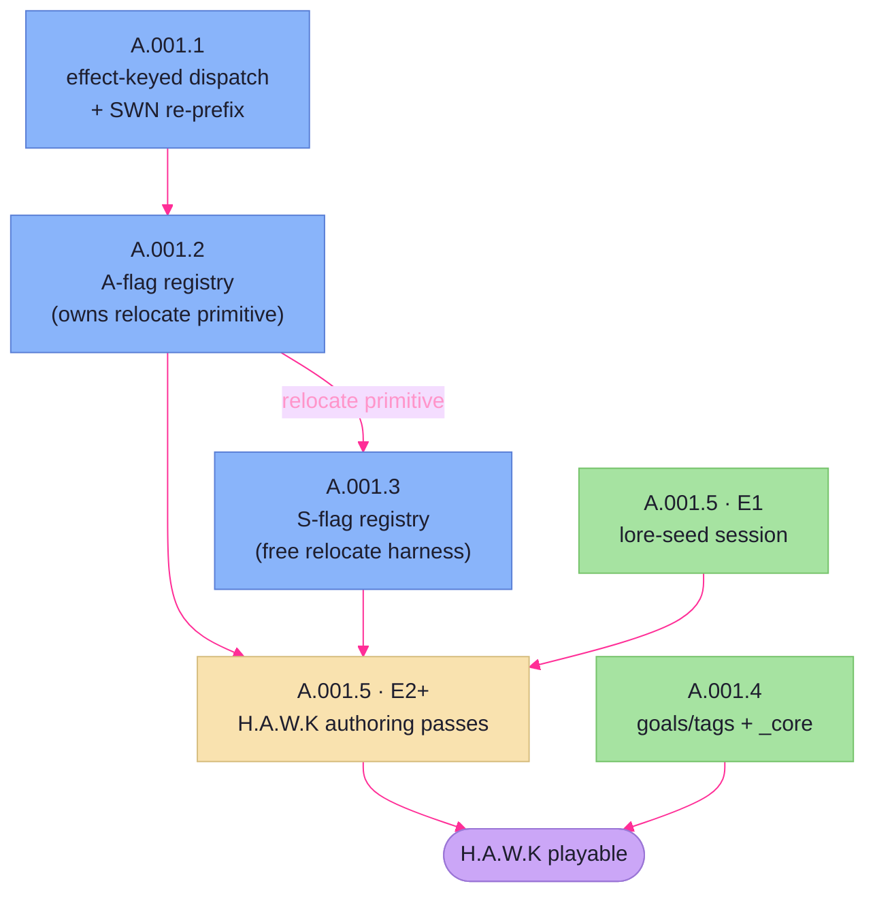

# Data-Driven Rulebook — Arc Plan

> **What this doc is.** The slicing of the `data-driven-rulebook` arc (A.001) into
> ordered initiatives — the DAG, each initiative's boundary, where every arc-discovery
> open question and reconciliation item lands, what gates what, and what the arc does
> not touch. It does **not** re-open the cross-cutting decisions; those are settled in
> the [arc-discovery](data-driven-rulebook-arc-discovery.md) (ACD-1…ACD-9) and bind
> every initiative below.
>
> **Inputs:** the [arc-discovery](data-driven-rulebook-arc-discovery.md) (binding —
> its Per-initiative seed, Open Questions, and Reconciliation items are the raw
> material here), the [arc-concept](data-driven-rulebook-arc-concept.md) (non-binding
> candidate list), and the [ability & effect catalog](../../../architecture/engine/ability-catalog.md)
> (binding mechanical decomposition, ACD-8).
>
> **Status:** arc-plan, written for sign-off. Once signed off, each initiative is
> registered in `planned-work.md` and runs its own lifecycle (session-modes section 9).

## The arc in five initiatives

| ID | Initiative | Type | Depends on |
|---|---|---|---|
| **A.001.1** | Effect-keyed A-dispatch + SWN re-prefix | refactor | — (arc entry) |
| **A.001.2** | A-flag ability registry | feature | A.001.1 |
| **A.001.3** | S-flag effect registry | feature | A.001.2 *(relocate primitive only)* |
| **A.001.4** | Goals/tags neutralization + `_core` home | feature | — |
| **A.001.5** | H.A.W.K asset authoring | feature | A.001.2, A.001.3, its own lore-seed effort |

The arc is a DAG, not a line: A.001.4 and A.001.5's lore-seed effort carry no
dependency on the registries and can run from the start; the registries themselves are
the only strictly-serial spine (A.001.1 → A.001.2 → A.001.3's relocate slice).

## Per-initiative boundaries

### A.001.1 — Effect-keyed A-dispatch + SWN re-prefix (refactor)

The ID/dispatch-layer refactor that unblocks the A-registry and hardens the SWN data
against ID changes. Two efforts, ordered:

- **Effort 1 — R.018, effect-keyed dispatch.** Replace `dispatch.go`'s
  `map[def.ID]AbilityHandler` with dispatch keyed on the ability's effect/primitive.
  Re-key the one real handler (`informers` → a `reveal_stealth` handler); the nine
  `confirmApplied` stubs collapse into the unknown-effect fallthrough. No new behavior —
  this re-keys, it does not author the registry.
- **Effort 2 — SWN re-prefix.** Rename SWN asset IDs (`C1-001` → `SWN-C1-001`) across
  `rulebooks/swn/assets/`; chase the hardcoded references (`B.001`'s
  `stealth_applicator`, the `G.012` goal ref); fix the test fixtures that pin old IDs.
  **Sequenced after Effort 1** so that, with dispatch already effect-keyed, the rename
  no longer touches dispatch code (arc-discovery seed).

**Covers:** making A-dispatch mechanic-keyed; the dataset-wide SWN ID rename.
**Punts:** the A-side composition pipeline and primitives (A.001.2); any contest/roll
extraction beyond what re-keying strictly needs.

### A.001.2 — A-flag ability registry (feature) — depends A.001.1

The composition pipeline, data-driven and effect-keyed: *target-selection →
(stat-contest | die-roll + outcome-table) → effect → mutations* (ACD-3). Extract the
stat-contest currently wired inside `informers`; fill or remove the dead
`Die`/`Outcomes` fields and resolve the dropped `[[ability.steps]]` (ACD-5); add the
A-side `coin_steal`/`coin_drain` handlers where the effect is action-spent. Grow the
flat `abilityRecord` to carry the structured `[ability]` block.

**Owns the shared `relocate-other` primitive (ACD-4):** builds the world-engine
relocate move (distinct from the drift-order path) **and** its action-spent harness
(Covert Shipping `C3-003`, Covert Transit Net `C6-002`). A.001.3 reaches the same
primitive through a free harness.

**Covers:** the A-side spine and its effects (catalog A-flag table); the relocate
primitive + action-spent harness; A-side latent-vocab repair.
**Punts:** all S-side hook/profile work and the free relocate harness (A.001.3).

### A.001.3 — S-flag effect registry (feature) — depends A.001.2 (relocate primitive only)

Generalize the `transport` pattern: a profile in the data registers the right hook from
the five canonical categories (`hooks/doc.go`), the way `TransportReactor` does today.
Hybrid data shape (ACD-5): keep typed profiles for parametric families, add a generic
`[effect]` (`type` discriminator + fields) for the simple flag-effects. Wire the S-side
`coin_steal`/`coin_drain` reactors and the rest of the catalog's S-flag table onto
their categories.

**Free relocate harness (ACD-4):** register an `AssetMovementGranter` from the asset's
profile, **wire `GrantedMovementAbilities` into the movement phase** (the seam exists
half-built and unconsumed today), and grow `MovementAbility` from its `{Name,
Description}` placeholder to carry/reference the relocate parameters (Transit Web
`W7-003`). Invokes A.001.2's primitive without spending the action.

**Covers:** the S-side profile→hook registration, the catalog's S-flag effects, the
free relocate harness + movement-phase wiring.
**Punts:** the A-side (A.001.2); the relocate primitive itself (consumes A.001.2's).

### A.001.4 — Goals/tags neutralization + `_core` home (feature) — no deps

Two data-layer moves, no registry dependency:

- **`_core` home (ACD-6).** Create `rulebooks/_core/` holding `goals.toml` +
  `tags.toml`; strip goals/tags from `rulebooks/swn/` and `rulebooks/hawk/`. The
  scaffold step composes core + the chosen rulebook into the campaign's `rulebook/`
  dir, so the on-disk result is unchanged and `rulebook.Load` never learns `_core`
  exists. This is a `campaigns`/scaffold change, **not** a loader change and **not** a
  new `Paths` field.
- **Neutralization (ACD-7).** Strip SWN flavor from the shared goals/tags as a
  **data-only** change — bare-ID handlers keep firing, no mechanic added/changed/removed.
  Because the same files now compose into both rulebooks, a neutralized tag must read
  neutral for **both** games at once.

**Covers:** the shared-source dedupe mechanism + the flavor neutralization.
**Punts:** goals authoring and tag *mechanic* changes (out of scope); `B.002` semantic
table keys (out of scope, untriggered — handlers keep firing on bare IDs).

### A.001.5 — H.A.W.K asset authoring (feature) — depends A.001.2, A.001.3, lore seed

Owns the living lore canon (ACD-9) and ships H.A.W.K's assets.

- **Effort 1 — lore-seed session (precursor).** Interview Robert on H.A.W.K's setting,
  factions, terminology, and the fiction behind its elements; seed the canon at
  `docs/campaigns/hawk/`. **Carries no registry dependency — schedulable from the start
  of the arc**, ahead of the registries, so authoring never invents canon cold.
- **Effort 2+ — by-category passes.** One category file at a time, Force → Cunning →
  Wealth. Each pass: **lore-gate** (confirm the batch against canon) → **reflavor**
  (name/description/fiction per asset, folded back into canon) → **mechanical sort**
  (classify each ability against the catalog — reuse a primitive / build a missing
  primitive / parameterize a near-miss) → **review** before commit. Output per pass:
  `rulebooks/hawk/assets/<category>_assets.toml`, any new registry primitives the sort
  required, and canon-doc updates. IDs gain the `HAWK-` prefix, initially mirroring
  SWN's tier suffix (`HAWK-F1-001`) and drifting as the set diverges.

**Covers:** the lore seed, the canon lifecycle, and the H.A.W.K asset content.
**Punts:** nothing within its surface — but it depends on the registries existing
(passes can't classify against primitives that aren't built).

## Per-initiative session shape

Each initiative runs the standard lifecycle (session-modes section 9): its own
Discovery → Plan → Execution, per its Type flow. The arc-level artifacts make
per-initiative **Discovery and Plan lighter, not absent** — no re-litigating
ACD-1…ACD-9; Discovery's agenda is the open questions this doc routed to the
initiative plus its own internal slicing, and Plan inherits the boundary above.

Session-modes sets no *floor*, so weight is **proportional to the routed question
load**, not uniform:

- **A.001.1 — collapse Discovery into Plan.** The catalog, the arc-discovery seed, and
  this doc have already specified it nearly to the line; its one routed question (does
  any scaffolded campaign need re-prefix migration?) is a binary fact-check, not a
  design exploration. A standalone Discovery doc would be ceremony. Run one
  Discovery+Plan session that answers the check inline and produces the implementation
  plan.
- **A.001.2 / A.001.3 / A.001.4 — focused full Discovery.** Each carries real routed
  design questions (sub-block nesting and dead-field fate; Monopoly's home; the hybrid
  profile shapes and movement-phase wiring; the neutralization flavor line). These earn
  a genuine — if scoped — Discovery before Plan.
- **A.001.5 — does not map cleanly onto Discovery/Plan.** Its "discovery" is the
  precursor **lore-seed session** (an interview), and its execution loop (lore-gate →
  reflavor → mechanical sort → review) is already specified in the seed. The session
  type this needs is one of the **deferred process-level items** (custom lore /
  ability-catalog session types); A.001.5 is the initiative that forces that gap, and
  the shape is settled when it is promoted, not here.

## Open-question routing

Every open question from the arc-discovery routing table, assigned to the initiative
that owns it.

| Open question (from arc-discovery) | Owned by |
|---|---|
| How to slice the arc into initiatives, and in what order | **Resolved here** (this doc) |
| Whether any already-scaffolded campaign needs SWN-ID re-prefix migration | **A.001.1** |
| Monopoly's flag-vs-text mismatch — re-derive its home from the mechanic | **A.001.2** |
| Exact `[ability]` sub-block nesting + fate of each dead field (A-side) | **A.001.2** |
| Exact `[effect]` sub-block nesting + fate of each dead field (S-side) | **A.001.3** |
| Neutralization's flavor-vs-mechanic line + `_core` compose mechanics | **A.001.4** |
| Precursor lore session — when it runs, how it seeds the canon | **A.001.5** (Effort 1) |
| Custom session types (lore, ability-catalog) + `goals.md` no-op wording (process) | **Out-of-arc** (process backlog) |

## Reconciliation-item routing

Each lands in the initiative whose hands are already on that surface (so the fix is free
context, not a separate context-reload).

| Reconciliation item (from arc-discovery) | Fixed in |
|---|---|
| Catalog hook-category renumber (Cat 4 = RuleModifier family, Cat 5 = TieResolver) | **A.001.3** |
| Catalog mis-files free `relocate-other` as Cat 3 — it's a Cat 4 `AssetMovementGranter` | **A.001.3** |
| `hooks.md` overstates the movement seam (`GrantedMovementAbilities` is unconsumed) | **A.001.3** (corrected when the call is wired) |
| `goals.md` "intentional flavor" wording (incremental seam, not an end state) | **A.001.4** |

## Cross-arc dependencies

Prerequisites — in-arc gates and the engine seams reached outside the registries.

- **A.001.2 ⟸ A.001.1.** The A-registry is authored against effect-keyed dispatch; it
  cannot land until the re-key does.
- **A.001.3's relocate harness ⟸ A.001.2's relocate primitive** (ACD-4: one primitive,
  many harnesses). The *rest* of A.001.3 is independent of A.001.2 and can proceed in
  parallel — only the free relocate slice waits.
- **A.001.5 passes ⟸ A.001.2 + A.001.3.** The mechanical sort reuses/extends built
  primitives; the passes can't classify against primitives that don't exist. A.001.5's
  lore-seed effort has no such gate.
- **"H.A.W.K playable" milestone ⟸ A.001.4.** A.001.4 doesn't gate authoring, but a
  playable H.A.W.K needs goals/tags composed from `_core`.
- **Engine seam touched outside the registries:** A.001.3 wires the **movement phase**
  (turn engine) to consult `GrantedMovementAbilities` — the half-built seam the
  arc-discovery verified is defined but unconsumed.

## Out-of-arc deferrals

Work this arc does not address (seeded by the arc-discovery Out-of-scope list):

- **`B.002` (semantic table keys).** Goals/tags keep bare mechanic IDs; their handlers
  keep firing, so `B.002` is not triggered.
- **Goals authoring / tag mechanic changes.** Goals copy verbatim; the tag pass is
  flavor-neutralization only.
- **Other rulebooks (WWN).** H.A.W.K is the first non-reference rulebook; WWN is the
  next beneficiary, not touched here.
- **`spatial/` and `drift_costs.toml`.** Carried as-is from the SWN shape.
- **Formalizing custom session types** (lore, ability-catalog) as process additions —
  process-level, deferred to the process backlog.

## Decision Record

Slicing decisions made this Arc-Plan session (provenance; durable ones graduate to the
relevant arch page at pre-merge).

- **AP-1 — R.018 is its own initiative (A.001.1), bundling the SWN re-prefix as Effort
  2.** Reconciled from a conflict between two slicing answers; chose the reading where a
  *dataset-wide* SWN ID rename gets an honest refactor home rather than living inside an
  "A-flag ability registry" boundary it exceeds. The re-prefix sequences after the
  dispatch re-key so it never touches dispatch code.
- **AP-2 — A.001.2 (A-registry) owns the world-engine `relocate-other` primitive;
  A.001.3 depends on it only for the free harness.** ACD-4 mandates one primitive, many
  harnesses; A-registry is the spine's first real build, so the primitive is born there
  and S-registry adds the movement-phase harness on top. Keeps the two registries
  otherwise parallel (only the relocate slice of A.001.3 waits).
- **AP-3 — The precursor lore session is Effort 1 of A.001.5, not a standalone
  initiative.** Canon lifecycle (seed + grow-through-authoring) stays in one initiative.
  But it carries no registry dependency, so it is schedulable in the arc's first tier,
  ahead of the registries — organizational ownership and scheduling diverge here, and
  the DAG expresses both.
- **AP-4 — Arc-scoped child IDs (`A.001.N`), diverging from flat `F`/`R`/`B`
  numbering.** Keeps the arc grouping explicit in `planned-work.md`. The existing
  `R.018` backlog row is subsumed by A.001.1 and removed to avoid a duplicate live row.
- **AP-5 — Per-initiative Discovery weight is proportional to the routed question load,
  not uniform.** Session-modes makes per-initiative Discovery "lighter, not absent" but
  sets no floor; this arc reads that as: A.001.1 collapses Discovery into Plan (one
  routed binary check, otherwise fully specified), A.001.2/.3/.4 get focused full
  Discovery, and A.001.5's session shape is deferred to its promotion (it needs the
  not-yet-formalized lore session type). See "Per-initiative session shape" above.
