# Architecture Diagram Kit

The binding reference for authoring or editing any diagram in `docs/architecture/`.
Read it before drafting a diagram; it fixes the diagram type, the palette, and the
copy-paste style headers so the eleven architecture diagrams read as one set.

The governing rule: **use the right diagram type for what is being shown.** Type
follows the *shape of the content*, not habit. A spatial layout is not a flowchart;
a recursion is not a grid. The sections below sort content into types and give a
worked template for each.

<br/>
<br/>

# Type by topology

| Content shape | Examples in our set | Type | Layout engine |
|---------------|---------------------|------|---------------|
| **Spatial** — a layout, a seam, a region composition | the engine↔interface seam, the execution three-band, the three-column working area | `block` | grid (manual placement) |
| **Flow** — a pipeline, a branch, a decision cascade | the phase pipeline, recoverable-vs-fatal, history→digest→renderer, the Update priority tree | `flowchart` | dagre |
| **Cyclic / cross-actor** — recursion, a round-trip between two parties | hooks dispatch + reactor recursion, the askCh/eventCh goroutine round-trip | `flowchart` + ELK, or `sequenceDiagram` | ELK, or sequence |

**How to choose.** Ask what the diagram *is*, not what it contains:

- If the reader needs to see **where things sit** relative to each other — columns,
  bands, a boundary crossed — it is spatial: `block`. Auto-layout engines
  compute position from edges and will fight you; block diagrams let you place the
  grid yourself.
- If the reader needs to follow **what happens in what order** down a path, it is a
  flow: `flowchart` with dagre. dagre handles linear spines, branches, and fan-outs
  cleanly.
- If the flow **loops back on itself** (a back-edge, a recursion, a request that
  parks until a reply) dagre sprawls. Reach for **ELK** (`layout: elk`) on a
  flowchart, or — when the cycle is really two actors exchanging over time — a
  `sequenceDiagram`, which sidesteps layout entirely.

<br/>
<br/>

# Palette

Catppuccin **Mocha**, on a dark canvas. Colour is **semantic and favours a cool
trio**: the *fill* carries a node's role, and the palette leads with **blue, pink,
and purple** — reach for those three first. Green and orange are *overflow*: pull
one in only when a single diagram has a fourth or fifth distinct role the cool trio
can't keep apart. Stroke and edge colour are left free to signal other things (a
dashed stroke for "planned", a bright edge for a flow path).

A hue therefore means one role *within* a diagram, not across the set: blue is the
process spine in a flowchart and the external driver in a spatial diagram. Pick the
hue by salience inside the picture you're drawing, not from a global role registry.

## Canvas

| Variable | Value | Use |
|----------|-------|-----|
| `background` | `#1e1e2e` | base — the dark canvas |
| `primaryTextColor` | `#cdd6f4` | default/unstyled text |
| line colour (block) | `#bac2de` | muted block connectors |
| line colour (flowchart) | `#ff2e97` | **bright neon-pink edges** |

The line-colour split is deliberate: a **block** diagram's motion is shown by muted
block-arrows *inside* a composition, so its lines stay quiet; a **flowchart**'s whole
point is the flow *between* steps, so its edges are bright neon pink and read as the
primary signal.

## Role → hue

The favored trio carries every diagram. Each hue does double duty — a spatial role
in `block` diagrams, a flow role in flowcharts. Strokes are a **darker** shade
of the fill (a deeper rim, not a lighter highlight); text is the dark base.

| Hue | `fill` | `stroke` | `color` (text) | Spatial role | Flow role |
|-----|--------|----------|----------------|--------------|-----------|
| blue | `#89b4fa` | `#5a7fd6` | `#1e1e2e` | `external` | `process` |
| pink | `#f38ba8` | `#d6607f` | `#1e1e2e` | `seam` | `decision` |
| purple | `#cba6f7` | `#a47fd6` | `#1e1e2e` | `core` | gate / 2nd step |

Overflow — reach for these **only** when a diagram has a fourth or fifth role the
trio can't separate:

| Hue | `fill` | `stroke` | `color` (text) |
|-----|--------|----------|----------------|
| green | `#a6e3a1` | `#79c574` | `#1e1e2e` |
| orange | `#fab387` | `#e08c54` | `#1e1e2e` |

Muted — subordinate infrastructure (block-arrows, save gates), never a primary role:

| `fill` | `stroke` | `color` (text) |
|--------|----------|----------------|
| `#45475a` | `#585b70` | `#cdd6f4` |

Roles, by what they mark:

- **external** — a driver / actor outside the subsystem (Drivers, a GM, a CLI)
- **seam** — an interface or boundary node (collector, observer)
- **core** — the subsystem under discussion (Engine, an orchestrator)
- **process** — a step in a flow (a phase, a transform)
- **decision** — a branch point (a predicate, a router)

<br/>
<br/>

# Style headers

Two copy-paste frontmatter headers. Pick by type.

## Block (spatial)

Colour applied per node with `style` statements (classDef support in block diagrams
is unreliable — use `style`):

```
---
config:
  theme: base
  themeVariables:
    background: '#1e1e2e'
    primaryTextColor: '#cdd6f4'
    lineColor: '#bac2de'
---
block
  ...
  style NodeId fill:#89b4fa,stroke:#5a7fd6,color:#1e1e2e,stroke-width:1px
```

## Flowchart (flow)

Colour applied with `classDef` (which *does* work in flowcharts), and **neon-pink
edges** via `lineColor`:

```
---
config:
  theme: base
  themeVariables:
    background: '#1e1e2e'
    primaryTextColor: '#cdd6f4'
    lineColor: '#ff2e97'
---
flowchart LR
  A["a step"]:::process --> B{"a branch"}:::decision

  %% favored trio — reach for these first (blue / pink / purple)
  classDef process  fill:#89b4fa,stroke:#5a7fd6,color:#1e1e2e
  classDef decision fill:#f38ba8,stroke:#d6607f,color:#1e1e2e
  classDef core     fill:#cba6f7,stroke:#a47fd6,color:#1e1e2e
  %% subordinate infra — save gates, muted nodes
  classDef muted    fill:#45475a,stroke:#585b70,color:#cdd6f4
  %% overflow (green #a6e3a1 / orange #fab387) — add a classDef
  %% only when a 4th/5th role needs separating
```

For an ELK flowchart (cyclic), add `layout: elk` to the `config` block and tune
`elk.cycleBreakingStrategy` / `elk.nodePlacementStrategy` only if the default sprawls.

<br/>
<br/>

# Block patterns

## Full-height span by nesting-inversion

Block diagrams have **no row-span**. To make a node span N rows, do not span it —
**shrink everything else into a nested block** and let the node sit beside that block
in the outer grid, where it inherits the outer row's full height.

The seam diagram uses this: the two seam rows (collector, observer) live in a nested
`block:Seam`, and Drivers / Engine sit in the outer `columns 3` row, stretching to the
seam block's full height.

## Two-tier visual vocabulary

- **Saturated blocks = entities.** A thing in the system is a coloured block (role hue).
- **Muted block-arrows = motion.** Flow *within* a spatial composition is a
  `<["label"]>(right)` block-arrow filled muted surface (`#45475a`), not a drawn edge.

Block-arrows are axis-aligned *shapes* placed in grid cells, so they are always
straight — which is why a spatial diagram can have merged, centred entities and still
show direction without slanted connecting lines. Label an arrow at the **origin** of
its flow (decisions-in arrow nearest the driver; events-out arrow nearest the engine).

## Transparent grouping

A nested `block:ID` used only for layout draws a box. Hide it with
`style ID fill:none,stroke:none`.

<br/>
<br/>

# Flowchart patterns

- **Edges are the signal** — neon pink, set once via `lineColor`. Keep node fills the
  subdued role hues so the bright path stands out against them.
- **dagre is the default** and handles linear spines, single branches, and interface
  fan-outs well. Most of our flow diagrams are dagre-safe.
- **Reach for ELK only on a back-edge / recursion / cycle.** dagre cannot route
  `direction` inside a connected subgraph and sprawls on cross-boundary loops; ELK
  exposes `cycleBreakingStrategy` and `nodePlacementStrategy` to drive them. Add
  `layout: elk` before hand-tuning anything.
- **Prefer `sequenceDiagram`** when the "cycle" is two actors exchanging over time
  (e.g. the engine goroutine parking on an unbuffered ask channel until the UI
  replies) — a sequence reads the round-trip natively and needs no layout engine.

<br/>
<br/>

# Rejected approaches & gotchas

- **`layout: fixed` is not portable.** It only resolves in the mermaid.ai visual
  editor, not in the open-source renderer GitHub and the IDE ship. Committed diagrams
  must render where we read them (Decision 7). Never commit `layout: fixed`.
- **Declare spatial diagrams as bare `block`.** It renders where we read these
  diagrams — GitHub's pinned Mermaid and the IDE preview (Decision 7). Nested
  composite blocks keep the `block:ID … end` form. Watch the span gotcha: column
  spans (`:n`) are reliable only at the **top level of a flat grid** — a span inside
  a nested block has nothing to stretch into, so keep spanned cells outermost.
- **dagre ignores `direction` inside a connected subgraph.** Parent direction wins.
  If a subgraph's internal orientation matters and it has external edges, it is a
  spatial diagram (`block`) or an ELK flowchart, not a dagre subgraph.
- **Verify in the open-source renderer, not the editor.** The recurring lesson behind
  both `fixed` and the `block` keyword: "renders in the editor" is not "renders where
  we ship." Sanity-check new syntax on mermaid.live or the IDE preview before
  committing it across the set.

<br/>
<br/>

# Reference example — the engine↔interface seam

The worked diagram every spatial pattern above is drawn from. Full-height merged
entities, a nested seam with stacked interfaces, straight muted block-arrows labelled
at their origins, cool Mocha roles on a dark canvas.

```mermaid
---
config:
  theme: base
  themeVariables:
    background: '#1e1e2e'
    primaryTextColor: '#cdd6f4'
    lineColor: '#bac2de'
---
block
  columns 3
  Drivers["Drivers<br>(TUI today;<br>future CLI / AI planner)"]
  block:Seam
    columns 3
    ArrowInL<["decisions in"]>(right)
    Collector(["collector"])
    ArrowInR<["&nbsp;"]>(right)
    ArrowOutL<["&nbsp;"]>(left)
    Observer(["observer"])
    ArrowOutR<["events out"]>(left)
  end
  Engine["Engine — composition root<br>rulebook · roller · hook registry<br>7 sub-engines · orchestrator"]

  style Drivers   fill:#89b4fa,stroke:#5a7fd6,color:#1e1e2e,stroke-width:1px
  style Engine    fill:#cba6f7,stroke:#a47fd6,color:#1e1e2e,stroke-width:1px
  style Collector fill:#f38ba8,stroke:#d6607f,color:#1e1e2e,stroke-width:1px
  style Observer  fill:#f38ba8,stroke:#d6607f,color:#1e1e2e,stroke-width:1px
  style ArrowInL  fill:#45475a,stroke:#585b70,color:#cdd6f4
  style ArrowInR  fill:#45475a,stroke:#585b70,color:#cdd6f4
  style ArrowOutL fill:#45475a,stroke:#585b70,color:#cdd6f4
  style ArrowOutR fill:#45475a,stroke:#585b70,color:#cdd6f4
  style Seam      fill:none,stroke:none
```


